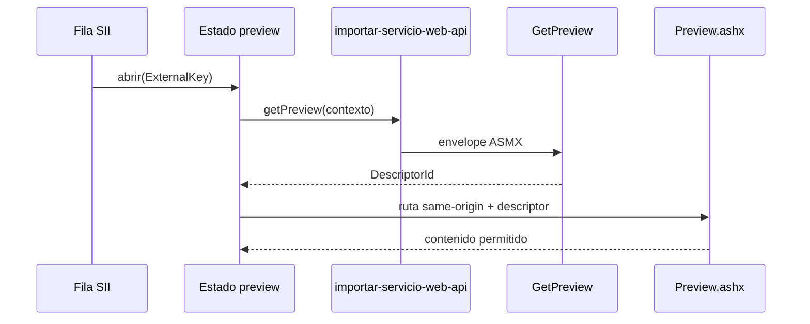

# Secuencia de preview seguro

```mermaid
sequenceDiagram
  participant Row as Fila SII
  participant State as Estado preview
  participant Api as importar-servicio-web-api
  participant Asmx as GetPreview
  participant Handler as Preview.ashx
  Row->>State: abrir(ExternalKey)
  State->>Api: getPreview(contexto)
  Api->>Asmx: envelope ASMX
  Asmx-->>State: DescriptorId
  State->>Handler: ruta same-origin + descriptor
  Handler-->>State: contenido permitido
```
