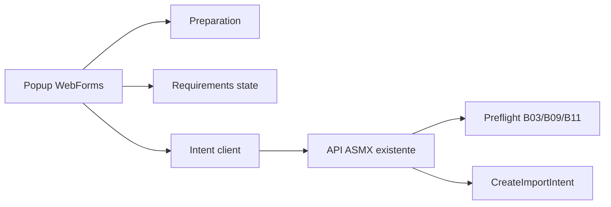
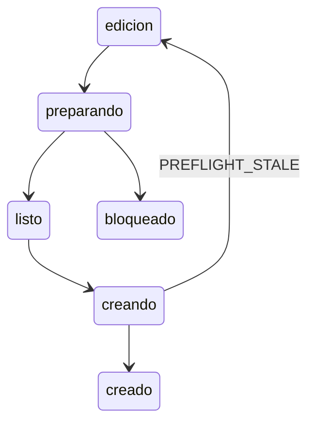

# Diagramas

## Componentes

```mermaid
flowchart LR
  UI[Popup WebForms] --> PREP[Preparation]
  UI --> STATE[Requirements state]
  UI --> CLIENT[Intent client]
  CLIENT --> API[API ASMX existente]
  API --> PF[Preflight B03/B09/B11]
  API --> INTENT[CreateImportIntent]
```

## Estados

```mermaid
stateDiagram-v2
  edicion --> preparando
  preparando --> listo
  listo --> creando
  creando --> creado
  preparando --> bloqueado
  creando --> edicion: PREFLIGHT_STALE
```

La secuencia detallada está en `Diagramas/secuencia-preparacion.md`.
