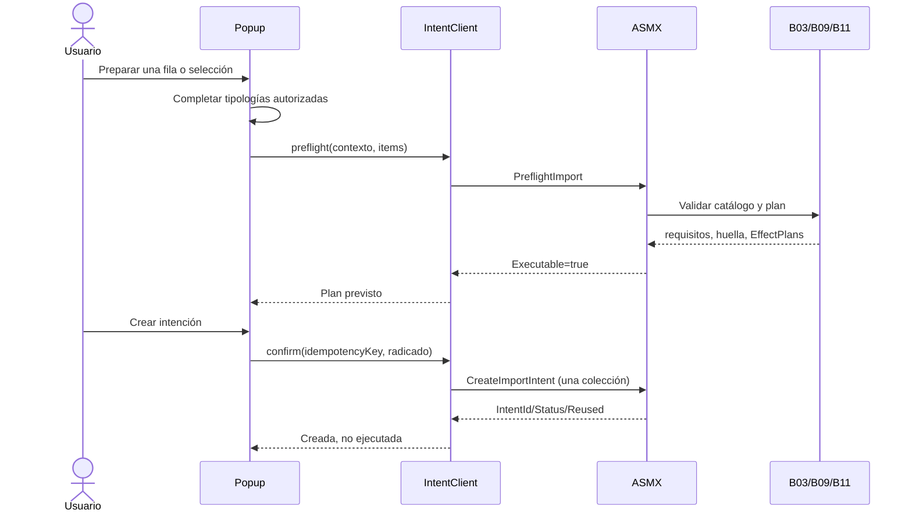

# Secuencia de preparación

```mermaid
sequenceDiagram
  actor U as Usuario
  participant UI as Popup
  participant C as IntentClient
  participant API as ASMX
  participant B as B03/B09/B11
  U->>UI: Preparar una fila o selección
  UI->>UI: Completar tipologías autorizadas
  UI->>C: preflight(contexto, items)
  C->>API: PreflightImport
  API->>B: Validar catálogo y plan
  B-->>API: requisitos, huella, EffectPlans
  API-->>C: Executable=true
  C-->>UI: Plan previsto
  U->>UI: Crear intención
  UI->>C: confirm(idempotencyKey, radicado)
  C->>API: CreateImportIntent (una colección)
  API-->>C: IntentId/Status/Reused
  C-->>UI: Creada, no ejecutada
```
