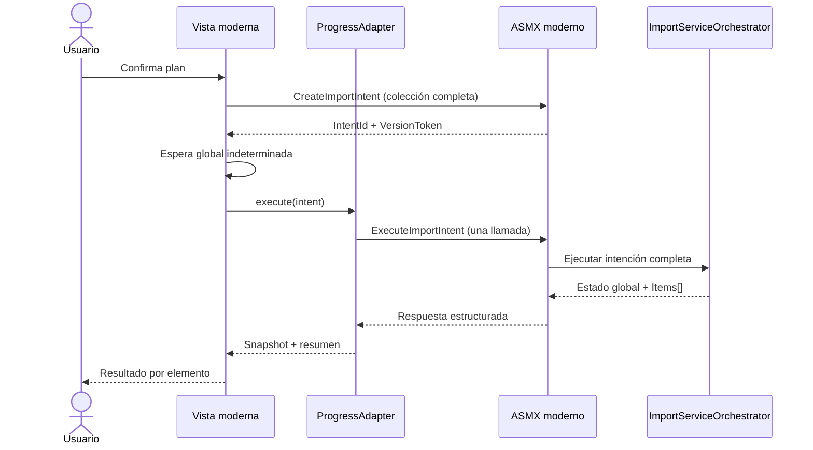

# Secuencia de ejecución

```mermaid
sequenceDiagram
    actor U as Usuario
    participant UI as Vista moderna
    participant A as ProgressAdapter
    participant API as ASMX moderno
    participant O as ImportServiceOrchestrator
    U->>UI: Confirma plan
    UI->>API: CreateImportIntent (colección completa)
    API-->>UI: IntentId + VersionToken
    UI->>UI: Espera global indeterminada
    UI->>A: execute(intent)
    A->>API: ExecuteImportIntent (una llamada)
    API->>O: Ejecutar intención completa
    O-->>API: Estado global + Items[]
    API-->>A: Respuesta estructurada
    A-->>UI: Snapshot + resumen
    UI-->>U: Resultado por elemento
```

No existe bucle de polling. Solo ante timeout, pérdida de respuesta o reapertura autorizada se permite una llamada explícita a `GetImportIntent`.
