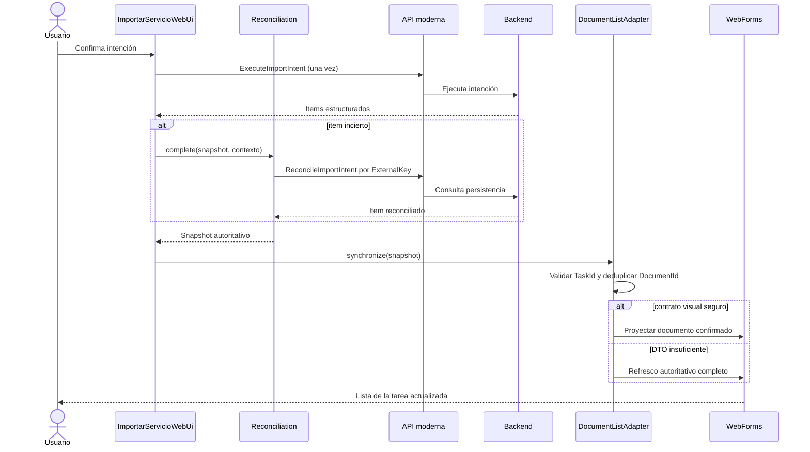

# Secuencia de reconciliación

```mermaid
sequenceDiagram
    actor U as Usuario
    participant UI as ImportarServicioWebUi
    participant R as Reconciliation
    participant API as API moderna
    participant B as Backend
    participant L as DocumentListAdapter
    participant W as WebForms

    U->>UI: Confirma intención
    UI->>API: ExecuteImportIntent (una vez)
    API->>B: Ejecuta intención
    B-->>UI: Items estructurados
    alt item incierto
        UI->>R: complete(snapshot, contexto)
        R->>API: ReconcileImportIntent por ExternalKey
        API->>B: Consulta persistencia
        B-->>R: Item reconciliado
    end
    R-->>UI: Snapshot autoritativo
    UI->>L: synchronize(snapshot)
    L->>L: Validar TaskId y deduplicar DocumentId
    alt contrato visual seguro
        L->>W: Proyectar documento confirmado
    else DTO insuficiente
        L->>W: Refresco autoritativo completo
    end
    W-->>U: Lista de la tarea actualizada
```

