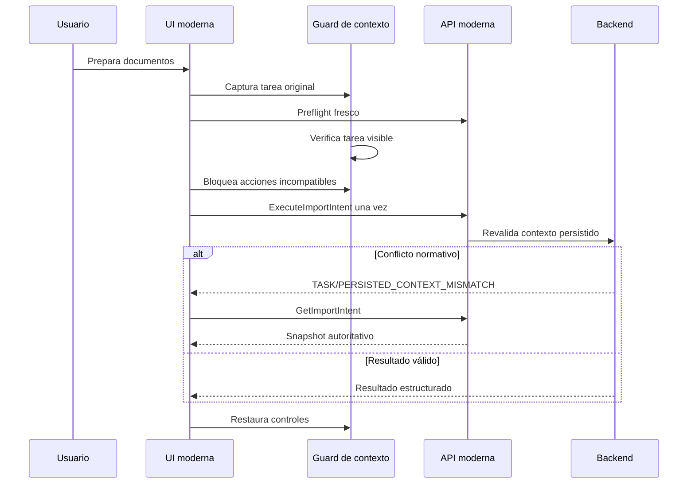

# Secuencia de protección y recuperación

```mermaid
sequenceDiagram
    participant U as Usuario
    participant UI as UI moderna
    participant G as Guard de contexto
    participant API as API moderna
    participant B as Backend
    U->>UI: Prepara documentos
    UI->>G: Captura tarea original
    UI->>API: Preflight fresco
    G->>G: Verifica tarea visible
    UI->>G: Bloquea acciones incompatibles
    UI->>API: ExecuteImportIntent una vez
    API->>B: Revalida contexto persistido
    alt Conflicto normativo
        B-->>UI: TASK/PERSISTED_CONTEXT_MISMATCH
        UI->>API: GetImportIntent
        API-->>UI: Snapshot autoritativo
    else Resultado válido
        B-->>UI: Resultado estructurado
    end
    UI->>G: Restaura controles
```
