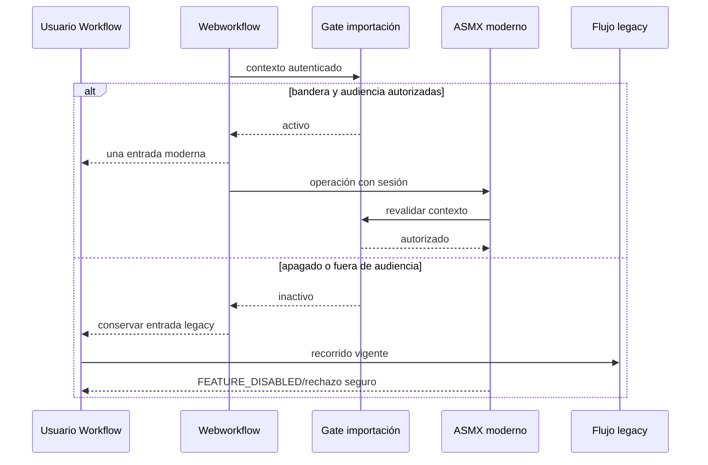

# Secuencia de gate y rollback

```mermaid
sequenceDiagram
    participant U as Usuario Workflow
    participant P as Webworkflow
    participant G as Gate importación
    participant A as ASMX moderno
    participant L as Flujo legacy

    P->>G: contexto autenticado
    alt bandera y audiencia autorizadas
        G-->>P: activo
        P-->>U: una entrada moderna
        P->>A: operación con sesión
        A->>G: revalidar contexto
        G-->>A: autorizado
    else apagado o fuera de audiencia
        G-->>P: inactivo
        P-->>U: conservar entrada legacy
        U->>L: recorrido vigente
        A-->>U: FEATURE_DISABLED/rechazo seguro
    end
```
