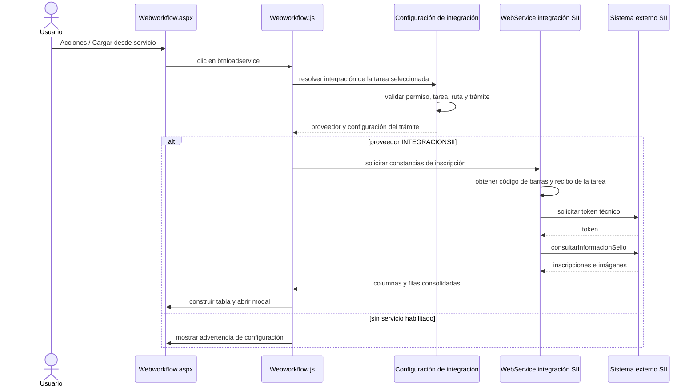
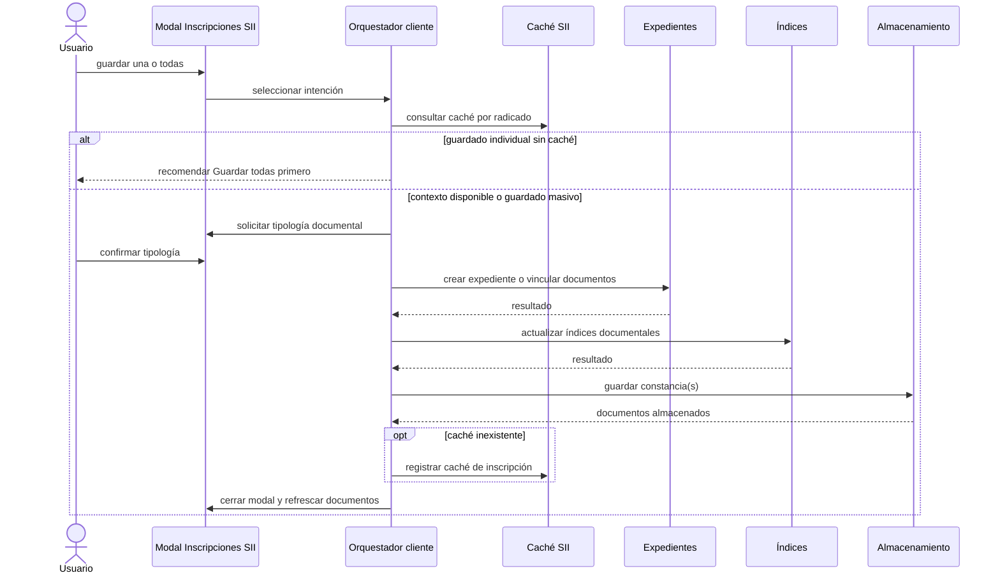
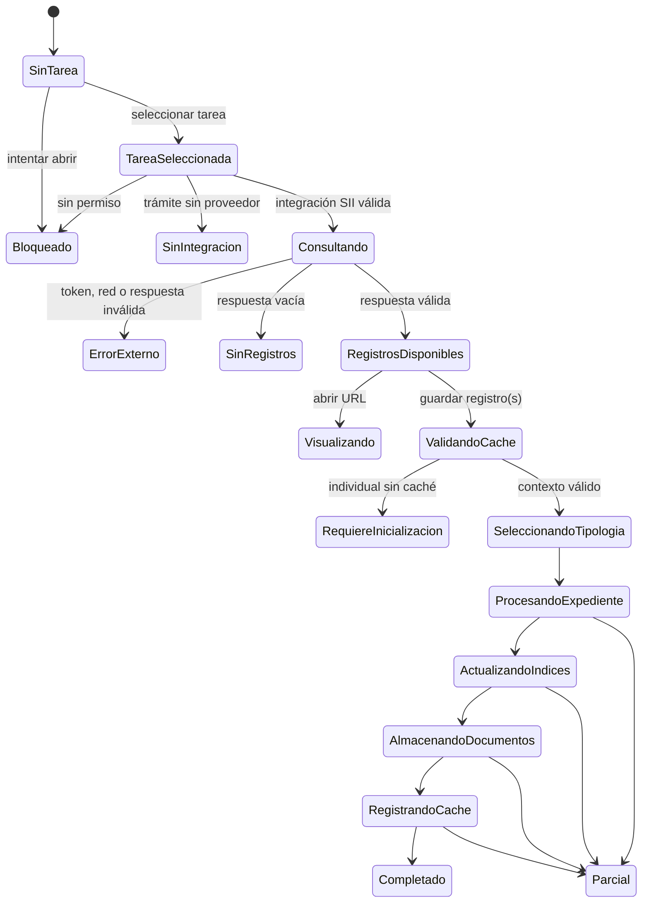

# Exploración de la modernización de Importar desde servicio web

## 1. Propósito

Documentar el comportamiento funcional y técnico actual de la opción **Cargar desde servicio**, observada en el centro de trabajo Workflow, y establecer un panorama seguro para una eventual modernización.

La exploración detallada de endpoints, asincronía, sesión, seguridad, transacciones, idempotencia, reconciliación y arquitectura multiproveedor del servidor se mantiene en `03-exploracion-backend-importar-servicio-web.md`.

Este documento es exclusivamente exploratorio. No autoriza ni implementa cambios funcionales, llamadas reales al servicio SII, escrituras, migraciones, cambios de permisos ni activación de gates.

## 2. Evidencia analizada

- Grabación funcional: `C:\Users\maum_\Downloads\Grabación 2026-09-03 175326-cargar-servicio-web.mp4`.
- Duración aproximada: 22 segundos.
- Recorrido estático por la interfaz, JavaScript, servicios ASMX, integración SII, expedientes, almacenamiento documental e índices del repositorio.
- No se ejecutaron servicios externos ni operaciones de escritura durante esta exploración.

## 3. Conclusión ejecutiva

La opción **Cargar desde servicio** no es un cargador de archivos convencional. Es un orquestador que puede:

1. Resolver la configuración de integración de una tarea Workflow.
2. Consultar inscripciones en un sistema externo SII.
3. Descargar o generar una constancia en PDF.
4. Crear un expediente o vincular documentos a uno existente.
5. Actualizar índices documentales.
6. Almacenar el documento en el gabinete correspondiente.
7. Registrar información auxiliar en caché SII.
8. Incorporar el documento resultante a la lista de documentos de la tarea.

Por su alcance, debe tratarse como una capacidad funcional independiente, no como un ajuste exclusivamente visual del menú de documentos.

## 4. Recorrido observado en la interfaz

1. El usuario tiene una tarea Workflow seleccionada.
2. Abre el menú **Acciones** del panel **Documentos**.
3. Selecciona **Cargar desde servicio**.
4. El sistema abre el modal **Inscripciones SII**.
5. El modal informa la cantidad de registros encontrados.
6. Se presenta una tabla con información registral, incluyendo:
   - libro;
   - inscripción o registro;
   - fecha y hora;
   - naturaleza del acto;
   - acto;
   - noticia;
   - URL;
   - recibo;
   - código de barras.
7. Cada registro dispone de acciones para descargar o abrir la constancia y para guardarla.
8. Existe la acción masiva **Guardar todas las inscripciones**.

La grabación demuestra la consulta y presentación del listado. No demuestra el resultado completo de una importación ni sus efectos persistentes.

## 5. Componentes identificados

| Responsabilidad | Componente actual |
|---|---|
| Entrada desde el menú | `workflow/Webworkflow.aspx`, controles `btnloadservice` y `ctw-document-action-service` |
| Despacho del evento | `js/workflow/Webworkflow.js` |
| Resolución del servicio configurado | `webservice/WebServiceAdjuntaDocumentoServicioIntegracion.asmx.vb` |
| Validación de tarea, permiso, trámite y proveedor | `ServiciosIntegracion/ClassAdjuntaDocumentoServicioIntegracion.vb` |
| Consulta y comandos SII | `webservice/WebService_integracion_sii.asmx.vb` |
| Autenticación y consulta al servicio externo | `Integracionccv/Class_consultarInformacionSello.vb` |
| Creación o vinculación de expedientes | `js/java_general/JSExpediente.js` y servicios asociados |
| Progreso de procesamiento masivo | `js/java_general/JSProgresBar.js` |
| Descarga, generación y almacenamiento | `workflow/ClassAlmacenamiento.vb` |
| Caché de inscripción | `Integracionccv/ClassRaSiiCahcheInscripcion.vb` |
| Actualización visual de documentos | `insert_row_documento_relacionado` en el cliente Workflow |

### 5.1 Decisión de alcance: capacidad genérica y adaptadores por proveedor

La modernización no se limitará a crear una nueva pantalla para SII. **ImportarServicioWeb** será una capacidad genérica de importación desde servicios externos y `INTEGRACIONSII` será su primer adaptador.

El código actual ya resuelve parcialmente el proveedor configurado mediante `NameService` e `IdServicioIntegracion`; sin embargo, el cliente solo despacha explícitamente `INTEGRACIONSII`. La modernización debe completar esa separación sin asumir que todo servicio externo comparte los conceptos registrales de SII.

La arquitectura objetivo será:

```text
ImportarServicioWeb
├── núcleo común
│   ├── contexto inmutable de tarea
│   ├── resolución del proveedor
│   ├── consulta sin mutación
│   ├── selección individual o múltiple
│   ├── captura de requisitos documentales
│   ├── progreso y decisiones
│   ├── resultados y reconciliación
│   └── actualización de la lista de documentos
└── adaptadores por proveedor
    ├── INTEGRACIONSII
    │   ├── inscripciones y constancias
    │   ├── metadatos registrales
    │   ├── caché SII
    │   └── reglas de expediente e índices SII
    ├── proveedor futuro A
    └── proveedor futuro B
```

#### Responsabilidades del núcleo común

El núcleo común será responsable de:

- abrir y cerrar la experiencia de importación;
- conservar el contexto de tarea y bloquear cambios durante una ejecución;
- resolver y cargar el adaptador del proveedor configurado;
- representar carga, vacío, indisponibilidad, error y acceso no autorizado;
- ofrecer selección individual o múltiple según las capacidades declaradas;
- capturar tipología y otros requisitos documentales comunes;
- presentar progreso real, decisiones y resultados por elemento;
- reconciliar el resultado contra el backend;
- incorporar los documentos confirmados a la lista de documentos de la tarea;
- evitar duplicados visuales y restaurar foco, filtros y navegación.

#### Responsabilidades de cada adaptador

Cada adaptador de proveedor será responsable de:

- invocar los endpoints de consulta y preparación que le correspondan;
- definir la identidad externa estable de sus elementos;
- traducir la respuesta del proveedor al contrato común;
- declarar columnas, metadatos y acciones específicas;
- suministrar la visualización o descarga mediada del recurso externo;
- validar y preparar los requisitos particulares de importación;
- traducir códigos y respuestas legacy a estados normalizados;
- ejecutar reglas propias de caché, expediente, índices u otras integraciones, sin trasladarlas al núcleo común.

Los conceptos `CIncripcionSII`, `CacheInscripcion`, `MULTIPLE_SII`, libro, registro, matrícula, acto, noticia y código de barras pertenecen al adaptador SII. No serán propiedades obligatorias, variables globales ni decisiones del componente común.

#### Contrato conceptual común

Sin fijar todavía nombres definitivos de DTO o endpoint, el frontend trabajará con un modelo equivalente a:

```text
ProveedorImportacion
├── id
├── nombre
├── capacidades
│   ├── permiteSeleccionMultiple
│   ├── permiteVistaPrevia
│   ├── requiereTipologia
│   ├── requiereExpediente
│   └── permiteDescarga
└── elementos[]
    ├── claveExterna
    ├── titulo
    ├── fecha
    ├── descripcion
    ├── estadoImportacion
    ├── metadatosPresentables[]
    └── accionesPermitidas[]
```

El contrato utilizará capacidades declaradas y no condiciones visuales codificadas por nombre de proveedor. Los metadatos particulares podrán presentarse mediante definiciones del adaptador, pero no adquirirán semántica global.

#### Flujo genérico de despacho

```text
abrir Cargar desde servicio
→ resolver proveedor configurado para la tarea
→ localizar adaptador compatible
→ consultar elementos externos sin mutación
→ normalizar y presentar resultados
→ seleccionar y completar requisitos
→ ejecutar importación
→ reconciliar contra la tarea original
→ actualizar filas externas y lista de documentos
```

Durante la transición se aplicará esta política:

| Situación | Comportamiento |
|---|---|
| Proveedor con adaptador moderno | Abrir la experiencia moderna |
| Proveedor conocido todavía no migrado | Conservar su recorrido legacy bajo el gate correspondiente |
| Proveedor sin adaptador ni recorrido compatible | Informar que no existe un importador habilitado |

El sistema no debe dirigir automáticamente un proveedor desconocido hacia SII ni presentar campos, mensajes o reglas SII fuera de su adaptador.

#### Consecuencia para la implementación por prompts

La implementación deberá separar como mínimo:

1. Un prompt para el núcleo frontend de **Importar desde servicio**, incluyendo registro de adaptadores, estados comunes, progreso, protección de tarea, reconciliación y actualización de documentos.
2. Un prompt para el adaptador frontend `INTEGRACIONSII`, incluyendo tabla registral, constancias, importación individual y múltiple, caché, expedientes, índices y traducción de los servicios actuales.
3. Prompts independientes para proveedores futuros, sin duplicar el modal, la navegación, el progreso, el bloqueo de contexto ni la reconciliación común.

Los prompts deberán distinguir expresamente las responsabilidades disponibles en frontend de las garantías que requieren contrato backend. El cliente no simulará identidad idempotente, autorización, persistencia, reconciliación ni progreso que el servidor no confirme.

## 6. Secuencia de consulta



### 6.1 Fuente de la identidad de tarea

Los servicios toman la tarea de `HttpContext.Current.Session.Item("ID_TAREA_SELECCIONDA")`. La operación depende, por tanto, de que la selección visible y la sesión estén sincronizadas.

### 6.2 Controles previos identificados

- Permiso de sesión `ADJUNTAR_IMAGENES_PREDETERMINADA`.
- Tarea seleccionada distinta de `0` y `-1`.
- Ruta Workflow válida.
- Campo de trámite configurado para la ruta.
- Trámite recuperable desde los datos adicionales de la tarea.
- Tipo documental entrante configurado.
- Servicio de integración asociado al trámite.
- Código de barras y recibo SII recuperables desde la tarea.

### 6.3 Integración externa

El servidor obtiene credenciales técnicas SII desde su configuración, solicita un token y ejecuta `consultarInformacionSello`. Las credenciales no se entregan al navegador.

La respuesta externa se transforma antes de enviarse a la UI. Parte de la información se presenta como columnas visibles y parte permanece como datos auxiliares necesarios para importar.

## 7. Secuencia de guardado



## 8. Guardado individual frente a guardado masivo

### 8.1 Guardado individual

El registro seleccionado se convierte en una estructura de inscripción con libro, registro, fecha, matrícula, proponente, identificación, razón social, acto, noticia, recibo, código de barras, URL y naturaleza del acto.

Antes de permitir su almacenamiento, el cliente consulta el caché del radicado. Cuando el caché no existe, el sistema recomienda ejecutar primero **Guardar todas las inscripciones**.

### 8.2 Guardado masivo

La operación masiva:

1. Recupera todas las inscripciones disponibles.
2. Consulta la estructura de caché.
3. Activa el modo múltiple.
4. Solicita la tipología documental.
5. Procesa expedientes, índices y almacenamiento.
6. Ejecuta el guardado por elemento mediante el componente de progreso.
7. Registra el caché si no existía.

Por ello, **Guardar todas** no es solamente un atajo de interfaz: cumple una función de inicialización funcional requerida por ciertos guardados individuales.

## 9. Preparación y almacenamiento del documento

### 9.1 Visibilidad del proceso recomendada

La experiencia no debe reducir la ejecución a una barra porcentual única. El código actual aplica fases comunes y posteriormente itera sobre las constancias, por lo que la interfaz debe presentar dos niveles:

- **Progreso global:** validación, preparación o vinculación de expediente, actualización de índices, almacenamiento documental y caché.
- **Progreso por inscripción:** pendiente, procesando, guardada, omitida, fallida o pendiente de decisión.

Para una importación individual se conserva la misma secuencia técnica, pero el lenguaje debe ser singular y centrado en la constancia seleccionada. Para una importación múltiple se debe indicar `registro actual / total`, conservar el resultado de cada elemento terminado y evitar presentar un éxito general si existen fallos parciales.

El modelo HTML asociado emula ambos recorridos. La simulación representa intención UX; no afirma que el backend actual exponga eventos intermedios suficientes para alimentar cada estado en tiempo real. Esa capacidad deberá formar parte del contrato de modernización.

#### Requisito obligatorio: reutilizar la barra de progreso existente

La modernización **debe reutilizar `js/java_general/JSProgresBar.js` como único ejecutor de progreso para el procesamiento secuencial**, tanto para múltiples inscripciones como para una colección de un solo elemento. No se debe crear una segunda barra, un ejecutor paralelo ni una simulación de progreso desconectada de la operación real.

`JSProgresBar` es infraestructura compartida por recorridos ajenos a `ImportarServicioWeb`, incluyendo creación y vinculación de expedientes, carga de archivos, firma digital, actualización de índices por lotes y eliminación documental. En consecuencia, no debe modernizarse de manera invasiva ni especializarse para SII.

#### Restricción arquitectónica: adaptador específico y compatibilidad

La integración con la interfaz moderna debe realizarse mediante un adaptador específico de `ImportarServicioWeb`:

```text
JSProgresBar compartido
├── consumidores existentes → comportamiento sin cambios
└── adaptador ImportarServicioWeb
    └── presentación moderna del progreso
```

El adaptador será responsable de traducir el progreso y los resultados actuales a estados de presentación propios de la capacidad, sin cambiar los contratos esperados por los demás consumidores.

Cualquier modificación interna de `JSProgresBar` queda restringida a callbacks o eventos que cumplan simultáneamente estas condiciones:

- sean opcionales;
- conserven los valores de retorno existentes;
- no cambien la secuencia cuando no se proporcionen;
- no incorporen conocimiento de SII ni de `ImportarServicioWeb`;
- mantengan los códigos `YES`, `CTRL` y `CTRLRETURN` durante la transición;
- cuenten con pruebas focales y de regresión para los consumidores compartidos identificados.

No se autoriza duplicar `JSProgresBar`, copiar su lógica, reemplazarla por temporizadores visuales ni modificar sus consumidores existentes para facilitar esta modernización.

Cuando sea estrictamente necesario, la extensión retrocompatible puede publicar eventos observables equivalentes a:

- inicio y cambio de fase global;
- inicio de un registro;
- cambio de progreso global y por registro;
- registro completado;
- registro omitido o con error controlado;
- solicitud de decisión para continuar o detener;
- finalización con resumen consolidado.

La interfaz moderna consumirá esos eventos para mostrar el estado real del proceso. No estimará porcentajes con temporizadores ni anunciará como completada una fase que el backend no haya confirmado.

Los códigos actuales `YES`, `CTRL` y `CTRLRETURN` deben preservarse mediante una capa adaptadora durante la transición. El resultado presentado al usuario debe diferenciar, como mínimo, guardadas, omitidas, fallidas y no procesadas.

Para la importación individual se utilizará el mismo mecanismo con una lista de un elemento. Esto evita mantener un segundo camino de ejecución y garantiza que las reglas de cancelación, error, progreso y resultado sean uniformes.

#### Requisito de interacción para guardar una inscripción

La acción **Importar** o **Guardar** de una fila debe abrir un popup secundario, contextual y de tamaño controlado, sin abandonar la lista de inscripciones. El popup debe:

1. Identificar inequívocamente el libro y número de inscripción seleccionados.
2. Presentar la lista de tipologías documentales permitidas para el trámite.
3. Exigir tipología cuando la configuración de digitalización la marque como obligatoria.
4. Mantener **Guardar** deshabilitado hasta completar los datos requeridos.
5. Permitir cancelar y devolver el foco a la acción de la fila sin producir mutaciones.
6. Al confirmar **Guardar**, cerrar el selector e iniciar `JSProgresBar` con una colección de exactamente un elemento.
7. Mostrar las fases y el resultado de esa constancia hasta recibir confirmación real del ejecutor.
8. Después del resultado, ofrecer **Volver a la lista** sin cerrar el modal principal ni perder el contexto de tarea y consulta.
9. Al regresar, reconciliar la lista con el estado persistido, limpiar la selección anterior y devolver el foco a un punto predecible de la lista.

El selector individual no debe invocar un camino de persistencia diferente al masivo. Su única diferencia es la captura contextual de la tipología y el uso de una colección de un registro.

#### Decisión recomendada: integración sin romper `JSProgresBar`

La capacidad debe incorporar un adaptador propio entre el orquestador de importación y el componente compartido:

```text
ImportarServicioWeb
└── ImportarServicioWebProgressAdapter
    ├── traduce respuestas legacy
    ├── conserva resultados por inscripción
    ├── presenta fases globales
    └── configura callbacks opcionales
        └── JSProgresBar
            └── servicios ASMX existentes
```

El cambio mínimo permitido en `JSProgresBar` consiste en aceptar callbacks genéricos, opcionales y sin efectos cuando no sean suministrados. Como referencia conceptual:

```text
onStart
onItemStart
onItemResult
onProgress
onDecisionRequired
onFinish
```

Esta extensión no puede cambiar el orden del ciclo, `_GeneraProcesingProgres`, `estado_control`, las reglas de pausa y cancelación, los valores de retorno ni la selección de servicio mediante `name_service`.

El adaptador debe mantener externamente una colección con el resultado de cada inscripción. Como mínimo registrará clave externa, estado normalizado, código legacy y mensaje seguro. La traducción requerida es:

| Código actual | Estado de presentación | Comportamiento |
|---|---|---|
| `YES` | Guardada | Continuar |
| `CTRL` | Omitida o no procesada | Registrar causa y continuar |
| `CTRLRETURN` | Requiere decisión | Pausar y solicitar decisión |
| Otro valor | Fallida | Conservar el comportamiento de detención vigente |

Los códigos internos no se mostrarán literalmente al usuario.

Las fases de validación, expediente, índices y caché se encuentran fuera del ciclo de almacenamiento de `JSProgresBar`. Por ello serán informadas por el orquestador o adaptador, mientras `JSProgresBar` reportará únicamente el avance real de los elementos que procesa. No se le trasladarán responsabilidades de SII, expedientes, índices ni caché.

Para una operación múltiple, `CTRLRETURN` debe ofrecer **Continuar con las demás** o **Detener importación**. Para una operación individual debe ofrecer **Cerrar y revisar** y, únicamente cuando el resultado sea reintentable e idempotente, **Reintentar**.

Durante la primera migración, los servicios ASMX pueden conservar su contrato. El adaptador normalizará sus respuestas. Una evolución posterior podrá incorporar resultados estructurados con código funcional, indicador de reintento y mensaje seguro, manteniendo una traducción compatible hacia los códigos que espera `JSProgresBar`.

Queda expresamente prohibido:

- copiar o duplicar `JSProgresBar`;
- crear una variante especializada como `JSProgresBarSII`;
- interceptar o sobrescribir globalmente los servicios usados por otros consumidores;
- cambiar la semántica de `CTRL` o `CTRLRETURN`;
- inventar progreso mediante temporizadores;
- hacer que el componente compartido conozca SII o `ImportarServicioWeb`;
- anunciar éxito general cuando existan registros omitidos, fallidos o no procesados.

#### Política de fallos parciales: continuar, detener y reintentar

La primera modernización debe ofrecer **Continuar con las demás** y **Detener importación** cuando un resultado `CTRLRETURN` pause una operación múltiple. No debe habilitar todavía **Reintentar fallidos**.

La semántica de presentación será:

| Situación | Decisión de interfaz | Estado del registro | Estado de los restantes |
|---|---|---|---|
| `YES` | Ninguna | Guardada | Continúan |
| `CTRL` | Continuidad automática | Omitida o no procesada | Continúan |
| `CTRLRETURN` en múltiple | Continuar o detener | Requiere decisión | Permanecen pendientes durante la pausa |
| Error no controlado | Detención según comportamiento vigente | Fallida | No procesados |
| Operación individual | Cerrar y revisar | Omitida, fallida o guardada | No aplica |

La acción **Continuar con las demás** debe conservar el resultado del registro actual y avanzar al siguiente. La acción **Detener importación** solo detiene los registros pendientes; no revierte documentos, expedientes, índices ni caché previamente procesados. No se utilizará la etiqueta ambigua **Cancelar** cuando la operación ya haya producido efectos.

El resumen final debe distinguir siempre:

- guardadas;
- omitidas;
- fallidas;
- no procesadas por detención.

No se mostrará éxito general cuando alguna categoría distinta de guardadas tenga elementos.

##### Restricción temporal de reintento

No se ofrecerá **Reintentar fallidos** mientras el backend no garantice:

1. Una clave idempotente estable por intención e inscripción.
2. Identificación de la fase exacta alcanzada por cada registro.
3. Diferenciación entre fallo anterior y posterior a la persistencia.
4. Clasificación estructurada de errores reintentables.
5. Reconciliación previa con documento, expediente, índices y caché.
6. Reutilización de la misma intención idempotente durante el reintento.

La ausencia de respuesta no se interpretará como ausencia de escritura. Un timeout puede ocurrir después de almacenar el documento y, sin reconciliación, el reintento podría duplicarlo.

Una fase posterior podrá habilitar **Reintentar fallidos** únicamente para elementos confirmados como no persistidos y con un resultado equivalente a `retryable: true`. El reintento deberá limitarse a esos elementos y utilizar la misma intención, no iniciar una importación ciega independiente.

#### Reconciliación de una fila después de importarla

Después de importar una inscripción, la interfaz debe conservar su fila y actualizar su estado; no debe eliminarla inmediatamente mediante manipulación local.

La transición esperada es:

```text
Disponible
→ Procesando
→ Verificando, cuando la respuesta sea incierta
→ Importada, Omitida, Fallida o No procesada
```

Una fila confirmada como **Importada** debe:

- mostrar claramente el nuevo estado;
- quedar fuera de nuevas selecciones masivas;
- deshabilitar u ocultar la acción **Importar**;
- conservar **Ver constancia**;
- ofrecer **Ver documento importado** cuando exista un identificador documental autorizado;
- mostrar fecha de importación cuando el backend la suministre;
- mantener una explicación accesible del resultado.

El estado de la fila solo cambiará definitivamente después de una confirmación real del backend. El resultado que actualmente alimenta `insert_row_documento_relacionado(...)` debe ser normalizado por el adaptador y utilizado para relacionar la inscripción con el documento incorporado a la tarea.

Para una importación individual, **Volver a la lista** debe ejecutar la reconciliación, limpiar la selección, conservar filtros y posición útil, marcar la fila importada y actualizar la lista de documentos de la tarea.

Para una importación múltiple, el panel de progreso conservará el resultado de cada elemento. Al regresar, se aplicará una reconciliación completa en lugar de modificar de manera independiente una tabla oculta durante el procesamiento.

La fuente de verdad debe ser el backend. La consulta de reconciliación deberá componer, según el modelo disponible, la identidad externa de la inscripción con tarea Workflow, código de barras, libro, registro, documento almacenado y caché SII. El contrato objetivo debe poder informar como mínimo:

```text
clave externa
estado de importación
identificador de documento
fecha de importación
permiso para importar nuevamente
```

Ante timeout o pérdida de respuesta, la fila no se marcará inmediatamente como fallida. Pasará a **Verificando** y se consultará la persistencia:

- si el documento existe y está relacionado correctamente, se marcará **Importada**;
- si se confirma que no existe, se marcará **Fallida** o **No procesada** según corresponda;
- si el estado sigue siendo incierto, se bloqueará el reintento y se informará la necesidad de revisión.

El listado debe soportar filtros equivalentes a **Todos**, **Disponibles**, **Importados** y **Con novedad**. Una fila solo desaparecerá del filtro **Disponibles** después de la reconciliación confirmada, no por una actualización optimista del navegador.

La secuencia obligatoria es:

```text
resultado confirmado
→ adaptador registra el resultado
→ backend reconcilia persistencia
→ actualizar fila de inscripción
→ actualizar documentos de la tarea
→ limpiar selección
→ conservar filtros y posición de navegación
```

#### Decisión de visualización: constancia externa y documento importado

La acción **Ver constancia** debe utilizar un panel lateral dentro del modal de importación. Este recorrido conserva la lista, selección, filtros, tipología preparada, posición de scroll y contexto de tarea. En pantallas pequeñas, el panel se transformará en una subvista completa con una acción explícita **Volver a la lista**.

El visor documental existente no se utilizará para una constancia externa que todavía no ha sido importada. Ese visor está asociado a documentos almacenados y relacionados con la tarea; usarlo antes de la importación confundiría los estados **disponible en SII** e **incorporado al sistema**.

Después de una importación confirmada, la acción **Ver documento importado** sí debe reutilizar el visor documental existente mediante el identificador interno retornado y reconciliado por el backend.

La apertura directa mediante `window.open(row.url, "_blank")` no será el recorrido principal. La pestaña nueva solo podrá utilizarse como fallback excepcional, cuando la política permita una descarga o visualización temporal mediada y no sea posible presentar el formato dentro del panel.

##### Mediación y seguridad

La interfaz no debe insertar una URL SII de la fila directamente en un `iframe` ni abrirla como origen confiable. El recorrido requerido es:

```text
solicitud de vista por identidad de inscripción
→ validación de sesión, tarea y permiso en backend
→ obtención o validación del recurso SII
→ respuesta temporal y saneada
→ presentación en panel lateral
```

El frontend enviará una identidad funcional estable de la inscripción, no una URL manipulable como autoridad de acceso. La respuesta no debe exponer token SII, credenciales, URL técnica permanente, ruta física, cadena de conexión ni respuesta externa completa.

El panel mostrará como mínimo libro, inscripción, fecha, naturaleza o acto, noticia, estado **Externa, aún no importada**, vista del documento y acción de cierre. Puede ofrecer **Importar esta constancia** respetando el popup obligatorio de tipología.

Los estados de visualización deben cubrir:

- preparando vista segura;
- constancia disponible;
- formato no visualizable con descarga temporal autorizada;
- recurso temporal vencido con opción de solicitar uno nuevo;
- servicio SII no disponible sin mutación;
- acceso no autorizado sin revelar información sobre el recurso.

La matriz de decisión es:

| Situación | Presentación requerida |
|---|---|
| Constancia externa sin importar | Panel lateral seguro |
| Pantalla pequeña | Subvista completa dentro del modal |
| Formato incompatible | Descarga temporal controlada |
| Fallback expresamente permitido | Pestaña nueva con recurso mediado |
| Documento importado | Visor documental existente |
| URL SII directa recibida en la fila | No utilizar como recorrido principal |

#### Protección contra cambio de tarea durante la ejecución

La importación no puede depender exclusivamente de `HttpContext.Current.Session("ID_TAREA_SELECCIONDA")`, porque la selección puede cambiar durante el proceso o desde otra pestaña que comparta la misma sesión ASP.NET. La protección debe combinar controles de interfaz con una garantía de backend.

##### Bloqueo visual durante la ejecución

Desde el inicio de una escritura hasta su finalización o detención, la interfaz debe:

- deshabilitar lista, selector y búsqueda de tareas;
- bloquear acciones que cambien la tarea o su estado, incluyendo continuar flujo, devolver y cerrar;
- mantener visible la tarea sobre la cual se ejecuta la importación;
- impedir cierre directo mediante `X`, `Escape` o clic exterior;
- ofrecer **Detener importación** con una explicación de sus efectos;
- informar que debe finalizarse o detenerse el proceso antes de cambiar de tarea.

Este bloqueo previene cambios accidentales, pero no constituye por sí solo una frontera de seguridad.

##### Contexto inmutable de la operación

Antes del primer efecto se debe crear una intención o contexto inmutable que vincule como mínimo:

```text
identificador de operación
identificador de tarea
identificador de ruta
usuario Workflow autenticado
proveedor
código de barras o identidad externa
fecha de inicio
```

La secuencia requerida es:

```text
consultar inscripciones
→ seleccionar y clasificar
→ ejecutar preflight de tarea, vigencia y permisos
→ crear intención vinculada a la tarea
→ comenzar escrituras
```

Cada endpoint mutador deberá validar que la intención pertenece al usuario, tarea, ruta, proveedor e inscripción correspondientes y que el usuario continúa autorizado. La sesión será un control adicional, pero no podrá sustituir silenciosamente la tarea vinculada a la intención.

##### Protección entre pestañas

Si otra pestaña cambia la selección de sesión, la operación conservará como destino la tarea de su intención. Mientras el backend actual dependa de la sesión, cualquier diferencia deberá detenerse como un conflicto equivalente a `TASK_CONTEXT_CHANGED`; nunca se aplicará el siguiente documento a la nueva tarea seleccionada.

Ante este conflicto, la interfaz debe mostrar guardadas, registro en conflicto y no procesadas, indicando expresamente que los efectos anteriores no fueron revertidos. No ofrecerá **Continuar con las demás** mientras el contexto sea inconsistente.

##### Navegación, cierre y recuperación

`beforeunload` puede advertir que existe una importación activa, pero no se considerará una garantía de integridad. El backend deberá permitir consultar y reconciliar posteriormente el estado de la intención ante recarga, cierre forzado o pérdida de conexión.

Al finalizar o detener:

1. Reconciliar los resultados contra la tarea original.
2. Liberar el bloqueo visual.
3. Habilitar nuevamente las acciones Workflow.
4. Verificar cuál tarea está seleccionada en ese momento.
5. Actualizar documentos únicamente si la vista corresponde a la tarea original.
6. Si la vista corresponde a otra tarea, informar dónde quedaron los documentos sin insertarlos en la lista equivocada.

No se propone inicialmente un bloqueo global de base de datos sobre toda la tarea. La protección es un bloqueo de contexto de importación y una intención inmutable, evitando interferir con procesos legítimos no relacionados.

La garantía final será:

```text
bloqueo UX contra cambios accidentales
+ intención inmutable ligada a la tarea
+ autorización backend por mutación
+ conflicto explícito ante cambio de contexto
+ reconciliación contra la tarea original
```

#### Estrategia aprobada de transición y retiro de controles legacy

La modernización se desplegará de forma reversible bajo el gate de presentación correspondiente. La primera entrega ocultará la presentación WebForms legacy, pero conservará temporalmente los controles técnicos que todavía participen en el ciclo de página o sean referenciados por código servidor.

La transición se realizará en este orden:

1. Mantener `btnloadservice` como punto de entrada compatible mientras el gate decide si abre el recorrido moderno o el existente.
2. Cuando la presentación moderna esté activa, evitar dos entradas visibles: `ctw-document-action-service` será la acción presentada al usuario y `btnloadservice` permanecerá oculto como puente de compatibilidad.
3. Ocultar bajo el gate el árbol visual legacy compuesto por `Panel_list_inscripciones_sii`, `GridView_list_inscripciones_sii`, `ModalPopupExtender_edition_list_inscripciones_sii` y `Panel_sube_documento_integra_sii`.
4. Conservar provisionalmente los botones ocultos de postback, extensores y handlers servidor que sigan teniendo referencias efectivas. No se eliminarán basándose únicamente en que no sean visibles.
5. Ejecutar regresión con el gate desactivado y activado. La E2E autorizada deberá demostrar apertura, consulta, selección, importación, resultado, reconciliación, foco y retorno a la tarea sin depender de la presentación legacy oculta.
6. Después de esa evidencia, eliminar el árbol WebForms legacy, sus handlers y controles auxiliares que hayan quedado sin referencias.
7. Retirar `btnloadservice` en una entrega posterior, únicamente cuando `ctw-document-action-service` sea la única entrada validada y no existan invocaciones directas o indirectas del identificador anterior.

La eliminación se divide, por tanto, en dos momentos:

| Momento | Acción |
|---|---|
| Primera modernización | Ocultar presentación legacy y conservar puentes técnicos necesarios |
| Después de E2E y regresión de ambos estados del gate | Eliminar markup, controles servidor, handlers y JavaScript sin referencias |
| Entrega posterior de limpieza | Retirar `btnloadservice` y el puente de compatibilidad |

El gate no debe dejar dos recorridos activos simultáneamente ni permitir que una misma acción dispare ambos handlers. Al desactivarlo, el comportamiento anterior debe continuar disponible hasta completar la validación y el retiro definitivo.

### 9.2 Comportamiento de almacenamiento identificado

El servicio `SeviceGuardaConstanciaInscripcionSII`:

1. Deserializa la inscripción recibida.
2. Establece la lista de chequeo documental en sesión.
3. Recupera la estructura del trámite.
4. Consulta los datos de expediente asociados a matrícula y proponente.
5. Completa identificación y razón social cuando corresponda.
6. Invoca `PreAlmacenaConstanciaIsncripcionsSII`.
7. Devuelve los datos necesarios para insertar el documento en la lista de la tarea.

La preparación de almacenamiento:

- valida la configuración de digitalización y la tipología obligatoria;
- utiliza una carpeta temporal por usuario;
- genera un nombre de PDF con usuario, código de barras, libro y registro;
- elimina un temporal anterior con el mismo nombre;
- determina el gabinete Workflow;
- recupera el caché del radicado;
- completa datos registrales faltantes;
- genera o descarga la constancia mediante la integración;
- continúa con el almacenamiento documental y la construcción del resultado visual.

## 10. Estados funcionales



## 11. Hallazgos y riesgos

### R-01. Atomicidad distribuida

La creación o vinculación del expediente, la actualización de índices, el almacenamiento del documento y el registro de caché se ejecutan mediante llamadas independientes. No se identificó una transacción que abarque todos los efectos.

**Impacto:** un fallo intermedio puede dejar expediente, índices, documento y caché en estados diferentes.

### R-02. Orden de efectos

El flujo actual crea o vincula el expediente y actualiza índices antes de confirmar el almacenamiento final de la constancia.

**Impacto:** pueden quedar referencias adelantadas si la descarga, generación o persistencia del PDF falla.

### R-03. Idempotencia no demostrada

No se identificó una intención idempotente explícita para la combinación tarea, código de barras, libro y registro.

**Impacto:** doble clic, reintento, pérdida de respuesta o concurrencia pueden producir documentos o relaciones duplicados.

### R-04. Estado mutable compartido

La implementación utiliza variables globales del navegador y valores de sesión, entre ellos `CIncripcionSII`, `CacheInscripcion`, `MULTIPLE_SII`, la tarea seleccionada y la tipología.

**Impacto:** cambiar de tarea, abrir más de un modal o ejecutar acciones simultáneas puede mezclar contextos.

### R-05. Contrato de resultado débil

Los servicios usan frecuentemente la cadena `YES` como éxito y texto libre para errores.

**Impacto:** el cliente no puede distinguir de forma robusta validación, conflicto, duplicado, indisponibilidad, timeout o fallo interno.

### R-06. Exposición de URL externa

La descarga abre directamente la URL retornada por SII en una pestaña nueva.

**Impacto:** deben evaluarse expiración, autorización, redirecciones, origen permitido y exposición de datos.

### R-07. Validación de autorización por endpoint

La apertura del listado valida tarea y permiso. Falta demostrar exhaustivamente que cada endpoint mutador repite autorización, vigencia y pertenencia, sin confiar en que el usuario abrió legítimamente el modal.

### R-08. Procesamiento masivo parcialmente observable

La operación múltiple usa una barra de progreso, pero debe verificarse si informa por registro cuáles fueron guardados, omitidos, duplicados o fallidos.

### R-09. Información registral en consola

El cliente contiene un `console.log` de las filas consolidadas retornadas por SII.

**Impacto:** puede exponer información registral en herramientas del navegador y debería retirarse al modernizar.

### R-10. Dos generaciones de UI

Conviven generación legacy desde servidor, eventos por atributos y una tabla Bootstrap generada desde metadatos.

**Impacto:** modernizar solo el aspecto puede conservar rutas divergentes y comportamientos inconsistentes.

### R-11. Archivos temporales

El nombre temporal se deriva de datos funcionales y se elimina si ya existe.

**Impacto:** deben verificarse aislamiento por usuario, saneamiento del nombre, colisiones, limpieza posterior y comportamiento concurrente.

### R-12. Acoplamiento entre inicialización y operación masiva

El requisito de guardar todas antes de una inscripción individual está implícito y aparece tarde.

**Impacto:** el usuario desconoce la consecuencia y puede interpretar el bloqueo como un error.

## 12. Límite recomendado para la modernización

La capacidad propuesta debe denominarse **ImportarServicioWeb** y conservar una separación explícita entre:

1. **Consulta sin mutación:** resolver proveedor y listar registros externos.
2. **Selección:** elegir registros y tipología.
3. **Plan de importación:** informar si se crearán expedientes, vínculos, índices, documentos y caché.
4. **Confirmación:** presentar el alcance antes de escribir.
5. **Ejecución idempotente:** procesar una intención identificable y reanudable.
6. **Resultado por elemento:** guardado, omitido, duplicado o fallido.
7. **Refresco:** reconciliar la lista de documentos contra el estado persistido.

La primera modernización puede reemplazar la experiencia visual y encapsular el recorrido existente, pero no debería alterar silenciosamente reglas de expedientes, índices o almacenamiento.

## 13. Propuesta conceptual de experiencia

Esta experiencia pertenece al núcleo común. Los nombres, columnas, metadatos y acciones particulares serán aportados por el adaptador activo. Los ejemplos registrales descritos a continuación corresponden al primer adaptador `INTEGRACIONSII`.

### Vista inicial

- Título común: **Importar documentos desde servicio**.
- Identificación visible y accesible del proveedor activo; para el primer adaptador: **SII**.
- Contexto visible de tarea, trámite y referencia externa parcialmente enmascarada cuando aplique.
- Estado de conexión o disponibilidad del proveedor.
- Acción de consulta con lenguaje suministrado por el adaptador; para SII: **Consultar registros**.

### Lista de resultados

- Selección individual y total.
- Columnas comunes y metadatos esenciales declarados por el adaptador.
- Detalle expandible para campos secundarios.
- Acción de visualización segura.
- Indicador de ya importado, disponible o con conflicto.
- Ausencia explícita de mutación durante la consulta.

### Preparación

- Tipología documental.
- Destino y gabinete.
- Requisitos adicionales declarados por el proveedor.
- Para SII, estrategia de expediente: crear o vincular.
- Resumen del número de registros.
- El núcleo no impondrá una operación masiva como requisito de inicialización. Si un adaptador legacy mantiene temporalmente esa restricción, deberá declararla de forma explícita y no presentarla como regla común.

### Ejecución y resultado

- Modal de tamaño estable con scroll interno.
- Progreso por elemento.
- Acción bloqueada mientras exista una ejecución activa.
- Resumen final con guardados, omitidos, duplicados y fallidos.
- En la primera modernización, decisión de continuar o detener ante los casos controlados definidos; sin acción general de reintento.
- En una fase posterior, posibilidad de reintentar únicamente elementos confirmados como no persistidos, reintentables y vinculados a la misma intención idempotente.

## 14. Contrato conceptual recomendado

Sin definir todavía endpoints definitivos, la modernización debería trabajar con respuestas estructuradas:

```text
ResultadoOperacion
├── exitoso
├── codigo
├── mensajeSeguro
├── correlacion
└── datos
```

Para una importación múltiple:

```text
ImportacionServicioWeb
├── idIntencion
├── idTarea
├── proveedor
├── estadoGeneral
└── elementos[]
    ├── claveExterna
    ├── estado
    ├── idDocumento
    ├── expediente
    └── codigoResultado
```

Los mensajes internos, credenciales técnicas, tokens, rutas físicas y respuestas externas completas no deben llegar a la UI ni a la evidencia E2E.

## 15. Seguridad que debe preservarse

- Sesión Workflow autenticada.
- Tarea explícita y vigente.
- Sincronización entre tarea visible y tarea de sesión.
- Permiso específico para adjuntar desde integraciones.
- Servicio habilitado para el trámite y la ruta.
- Autorización repetida en todos los endpoints mutadores.
- Tipología obligatoria cuando la configuración lo exija.
- Validación del destino documental y del expediente.
- URLs externas controladas o mediadas por el servidor.
- Evidencia y logs saneados.
- Prohibición de exponer credenciales, tokens, cookies, cadenas de conexión y rutas físicas.

## 16. Estrategia de validación futura

Una eventual implementación debe integrar sus pruebas en el mismo cambio funcional y reutilizar exclusivamente la infraestructura E2E existente bajo `tools/e2e/`.

### Pruebas focales

- Resolución de proveedor por trámite.
- Registro y selección del adaptador según capacidades declaradas.
- Rechazo seguro de proveedores sin adaptador ni recorrido compatible.
- Normalización del contrato común sin campos obligatorios de SII.
- Transformación y saneamiento de registros SII.
- Validación de tipología obligatoria.
- Detección de duplicados.
- Estados parciales y códigos funcionales.
- Construcción segura de nombres temporales.
- Reglas de guardado individual y masivo.

### E2E de lectura, sin mutación

- Usuario autorizado y tarea válida.
- Tarea no seleccionada.
- Usuario sin permiso.
- Trámite sin integración.
- Proveedor indisponible.
- Cero, uno y múltiples registros.
- Visualización sin alterar documentos, expedientes, índices, caché ni auditoría.

### E2E de escritura autorizada

- Requiere ambiente, cuenta y tarea descartable expresamente autorizados.
- Guardado individual con caché válido.
- Compatibilidad temporal del bloqueo individual legacy cuando falta la inicialización requerida.
- Recorrido moderno sin exigir una operación masiva como inicialización, una vez exista el contrato backend necesario.
- Guardado masivo.
- Tipología obligatoria.
- Creación de expediente y vinculación a existente, según aplique.
- Documento visible después de persistir.
- En una fase posterior, reintento idempotente sin duplicado para resultados expresamente reintentables.
- Resultado parcial controlado.
- Concurrencia de dos intenciones sobre el mismo registro.
- Verificación mediante consultas exclusivamente `SELECT`.

### Regresión visual

- Menú de acciones y colores existentes.
- Modal estable y scroll interno.
- Tabla usable con registros extensos.
- Foco, teclado, cierre y restauración de foco.
- Progreso y mensajes persistentes únicamente durante el tiempo necesario.

## 17. Evidencia requerida para considerar el cambio cerrado

- Código y pruebas como una sola unidad de entrega.
- Pruebas focales y build correspondiente.
- E2E real autorizada de consulta y, cuando corresponda, escritura.
- Evidencia saneada por escenario.
- Estado anterior y posterior de documento, expediente, índices, caché y auditoría.
- Confirmación de ausencia de duplicados.
- Resultado por registro en operaciones masivas.
- Registro explícito de bloqueos de ambiente, configuración, datos o autorización.
- Rollback técnico y funcional documentado.

## 18. Decisiones cerradas durante la exploración

1. **Alcance:** `ImportarServicioWeb` será una capacidad genérica y SII será su primer adaptador.
2. **Progreso:** se reutilizará `JSProgresBar` mediante callbacks opcionales y un adaptador propio; no se duplicará ni se simulará progreso.
3. **Códigos legacy:** `YES`, `CTRL` y `CTRLRETURN` se conservarán internamente y se traducirán a estados y decisiones comprensibles.
4. **Fallos parciales:** la primera modernización ofrecerá continuar o detener cuando corresponda; no ofrecerá reintento general de fallidos.
5. **Reconciliación:** una fila importada se conservará y actualizará desde el estado confirmado por backend.
6. **Documentos de la tarea:** todo documento importado y confirmado se incorporará o reconciliará en la lista principal de documentos de la tarea original.
7. **Visualización:** la constancia externa se mostrará en un panel lateral seguro; el visor documental existente se reservará para documentos ya importados.
8. **Contexto:** la ejecución combinará bloqueo de interfaz, intención inmutable, autorización por mutación y reconciliación contra la tarea original.
9. **Inicialización:** el núcleo moderno no exigirá **Guardar todas** para permitir una importación individual; la preparación requerida se separará de la cardinalidad de la selección.
10. **Transición legacy:** primero se ocultará la presentación antigua bajo gate; los controles técnicos se retirarán después de regresión y E2E autorizada, y `btnloadservice` se eliminará en una limpieza posterior.

## 19. Validaciones pendientes de backend y configuración

Estas preguntas no impiden diseñar ni dividir los prompts frontend, pero sí condicionan la implementación completa de las garantías mutadoras:

1. ¿Qué identidad externa estable aporta cada proveedor y cuál será la clave idempotente definitiva de SII?
2. ¿Qué proveedores están configurados actualmente además de `INTEGRACIONSII` y cuáles poseen un recorrido legacy que deba conservarse?
3. ¿Qué operaciones de expediente, índices, almacenamiento y caché son transaccionales hoy y cuáles requieren compensación?
4. ¿Cómo se reconcilia o compensa un expediente creado cuando falla el almacenamiento documental?
5. ¿Puede la actualización de índices ejecutarse después de almacenar y verificar el documento?
6. ¿Qué auditoría se registra actualmente por consulta, visualización, descarga, importación, vínculo y fallo?
7. ¿Qué propiedades de seguridad y expiración tienen los recursos externos de SII y de cada proveedor?
8. ¿Cómo se limpia la carpeta temporal y qué ocurre si dos sesiones importan el mismo elemento?
9. ¿Qué endpoint permitirá preparar el contexto o caché SII sin obligar a importar todas las inscripciones?
10. ¿Qué límites de cantidad, tamaño y tiempo declara cada proveedor para el procesamiento masivo?
11. ¿Qué metadatos puede mostrar cada adaptador según el perfil del usuario y cuáles deben enmascararse?

## 20. Decisión recomendada antes de implementar

Crear un cambio OpenSpec independiente para **ImportarServicioWeb** y dividir la entrega, como mínimo, entre el núcleo frontend genérico y el adaptador `INTEGRACIONSII`.

La exploración es suficiente para redactar los prompts frontend. Cada prompt deberá identificar:

- responsabilidades del núcleo y del adaptador;
- contratos backend disponibles y contratos todavía requeridos;
- comportamiento permitido durante la transición;
- estados que no pueden simularse en el cliente;
- pruebas focales y regresión del gate;
- condiciones de E2E que requieren autorización explícita.

No se recomienda sustituir directamente los servicios actuales ni retirar el recorrido legacy antes de demostrar la convivencia reversible. El núcleo mutador requerirá diseño explícito de idempotencia, autorización, transacción o compensación y recuperación antes de prometer esas garantías en producción.
