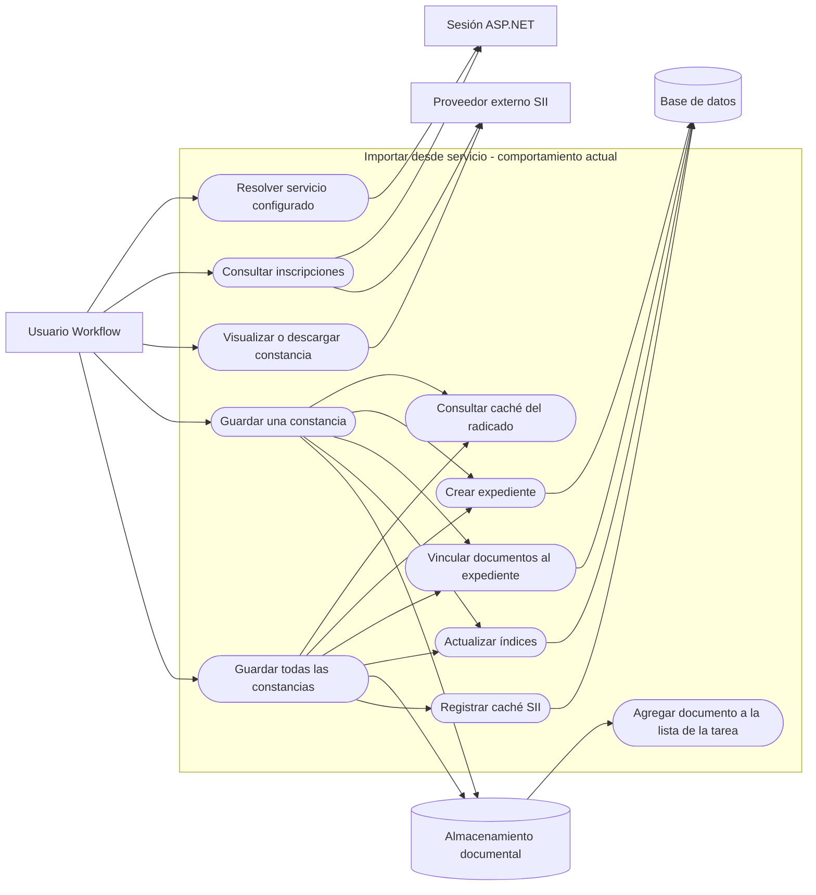
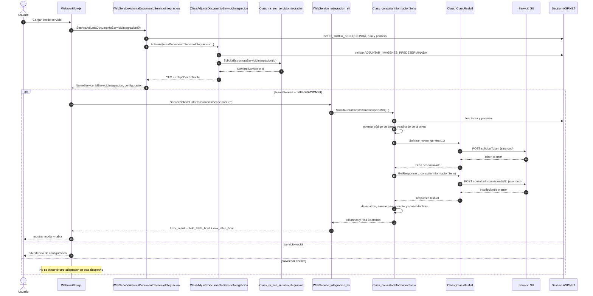
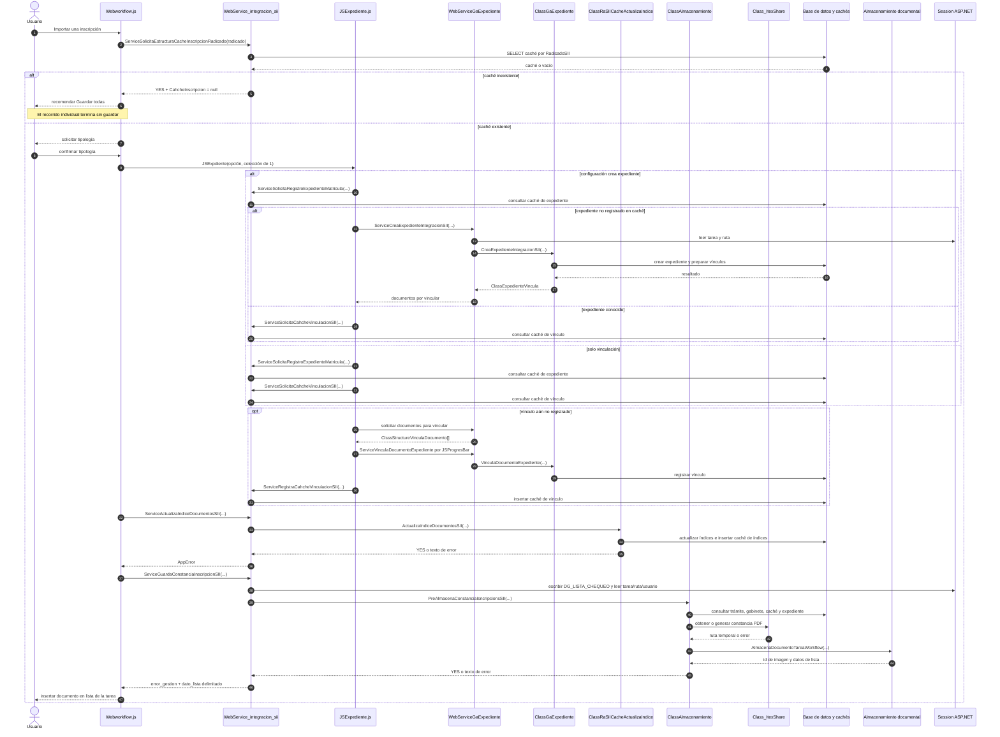
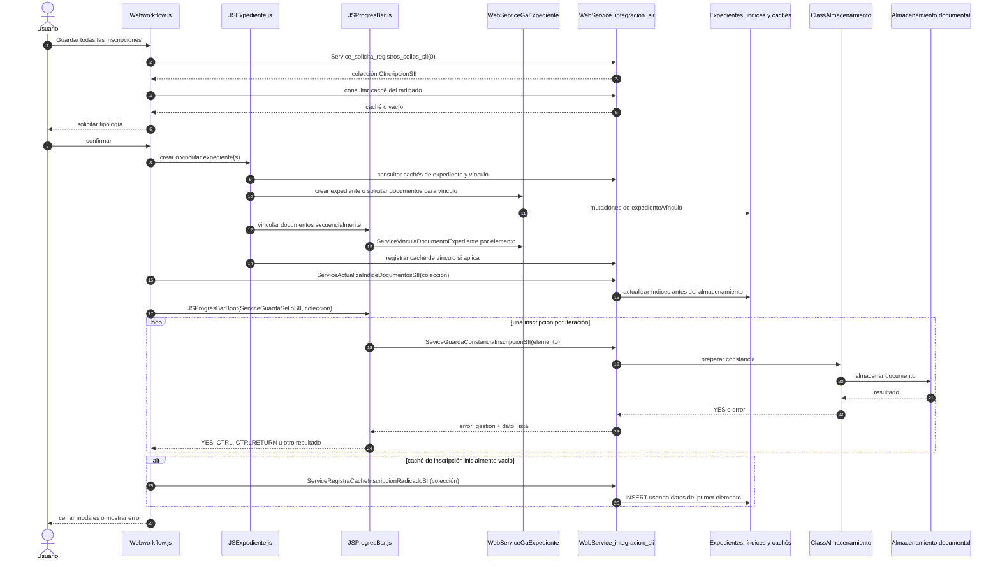
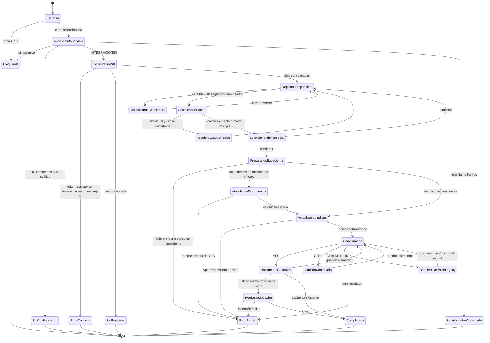
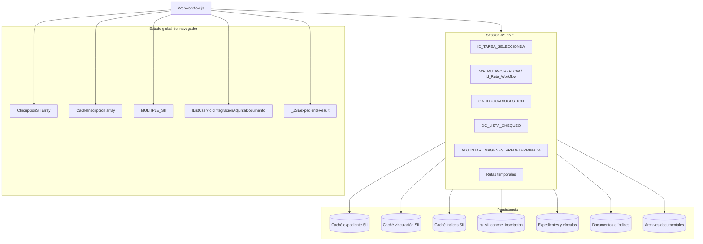
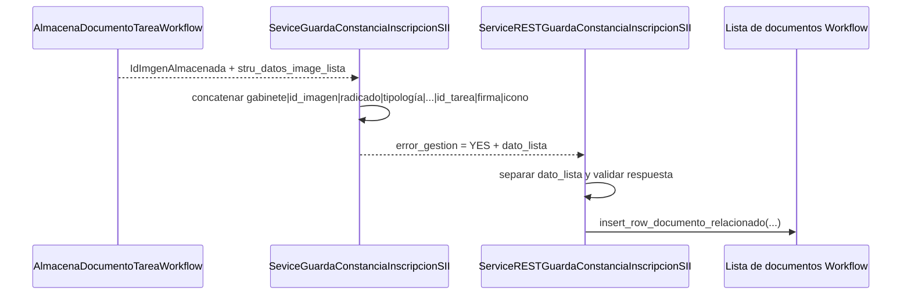

# Radiografía del backend actual de ImportarServicioWeb

## 1. Propósito y alcance

Representar, con nombres y relaciones observados en el repositorio, el funcionamiento backend actual de **Cargar desde servicio** para `INTEGRACIONSII`.

Esta radiografía describe el sistema existente; no representa la arquitectura objetivo. Incluye al navegador porque actualmente actúa como orquestador de varios endpoints backend independientes.

No se ejecutaron servicios, escrituras ni E2E. Los diagramas provienen de análisis estático. Cuando una consecuencia depende de datos, configuración o procedimientos no inspeccionados en ejecución, se marca como no demostrada.

Cada diagrama también está disponible como archivo Mermaid independiente en `DiagramasBackendActual/`.

## 2. Convenciones

| Notación | Significado |
|---|---|
| Flecha continua | Invocación observada |
| Flecha de retorno | Resultado consumido por el llamador |
| `YES` | Convención textual de éxito existente |
| Sesión | Lectura o escritura de `HttpContext.Current.Session` |
| Caché SII | Tablas auxiliares de inscripción, expediente, vínculo o índices |
| No demostrado | No puede confirmarse únicamente con el recorrido estático |

## 3. Diagrama de clases y dependencias actuales

```mermaid
classDiagram
    direction LR

    class WebworkflowJS {
      +ActivaServicioIntegracionAdjuntaDocumentosSistemasExternos()
      +ActivaGuardarMultiplexConstanciasInscription()
      +ActivaGuardarContasnciaInscripcion(element)
      +GuardarConstanciaIncripcionSII(tipo)
      +ServiceRESTactualizaIndiceDocumentosSII(...)
      +ServiceRESTGuardaConstanciaInscripcionSII(...)
      +ServiceRESTregistraCacheInscripcionRadicadoSII(...)
    }

    class JSexpdiente {
      +LoadJServiceExpediente()
      +VinculaDocumentosExpedienteSII(...)
      +CreaExpedienteVinculaDocumentoSII(...)
    }

    class JSProgresBar {
      +LoadJSProgresBar()
      +ServiceGuardaSelloSII
      +ServiceVinculaDocumentoSII
      +ServiceRegistraExpeidenteSIIVincula
    }

    class WebServiceAdjuntaDocumentoServicioIntegracion {
      +ServiceAdjuntaDocumentoServicioIntegracion(parameter)
      +ServiceAdjuntaDocumentoServicioIntegracionEnlace(parameter)
    }

    class ClassAdjuntaDocumentoServicioIntegracion {
      +ActivaAdjuntaDocumentoServicioIntegracion(tarea, ruta, ...)
    }

    class Class_ra_ser_servicioIntegracion {
      +SolicitaEstructuraServicioIntegracion(id, estructura)
      +SolicitaDatosCamposIndiceGabineteIntegracion(...)
    }

    class WebService_integracion_sii {
      +ServiceSolicitaListaConstanciaInscripcionSII(codigo)
      +ServiceSolicitaEstructuraCacheInscripcionRadicado(recibo)
      +ServiceActualizaIndiceDocumentosSII(inscripciones, tramite, recibo)
      +SeviceGuardaConstanciaInscripcionSII(inscripcion, tipologia, tramite)
      +ServiceRegistraCacheInscripcionRadicadoSII(inscripciones, tramite)
      +ServiceSolicitaRegistroExpedienteMatricula(inscripciones, tramite)
      +ServiceSolicitaCahcheVinculacionSII(inscripciones)
      +ServiceRegistraCahcheVinculacionSII(cache)
      +ServiceActualizaEstadoVinculacionDocumentoSII(expediente)
    }

    class WebServiceGaExpediente {
      +ServiceCreaExpedienteIntegracionSII(tramite, inscripciones)
      +ServiceSolicitaDocumentosVinculacionUnicoExpedienteSII(...)
      +ServiceSolicitaDocumentosTareaWorkflowVinculacionMultipleExpedientesSII(...)
      +ServiceVinculaDocumentoExpediente(documento)
    }

    class Class_consultarInformacionSello {
      +SolicitaListaConstanciasIncripcionSII(...)
      +Lista_inscripciones_radicado_sii(...)
      +ConSultarInformacionSello(radicado, respuesta)
      +ConsolidaListaConstanciasIscripcionesSII(...)
    }

    class Class_ClassResfull {
      +Solicitar_token_general(...)
      +GetResponse(...)
      +GetResponse_GET(...)
      +GetResponse_POST(...)
      -GetResponseAsync(...)
      +GetResponse_POST_Async(...)
    }

    class ClassGaExpediente {
      +CreaExpedienteIntegracionSII(...)
      +VinculaDocumentoExpediente(...)
      +SolicitaEstructuraExpedienteDocumentoVinculante(...)
    }

    class ClassRaSIiCacheExpediente {
      +SolicitaRegistroExpedienteMatricula(...)
      +RegistraCacheCreacionExpedienteSII(...)
      +SolicitaCacheCreacionExpedienteSII(...)
      +ActualizaEstadoVinculacionDocumentoSII(...)
    }

    class ClassRaSiiCacheVinculacion {
      +SolicitaCahcheVinculacionSII(...)
      +RegistraCahcheVinculacionSII(...)
    }

    class ClassRaSIICacheActualizaIndice {
      +ActualizaIndiceDocumentosSII(...)
      +InsertarCacheIndiceSII(...)
      +SolicitaCacheIndiceSIIRadicado(...)
    }

    class ClassRaSiiCahcheInscripcion {
      +SolicitaEstructuraCacheInscripcionRadicado(...)
      +RegistraCacheInscripcionRadicadoSII(...)
    }

    class ClassAlmacenamiento {
      +PreAlmacenaConstanciaIsncripcionsSII(...)
      +AlmacenaDocumentoTareaWorkflow(...)
    }

    class Class_ItexShare {
      +ItexConstanciaIsncripcionSII(...)
    }

    class SessionASPNet {
      +ID_TAREA_SELECCIONDA
      +WF_RUTAWORKFLOW
      +Id_Ruta_Workflow
      +DG_LISTA_CHEQUEO
      +GA_IDUSUARIOGESTION
      +ADJUNTAR_IMAGENES_PREDETERMINADA
    }

    class ServicioSII {
      +solicitarToken
      +consultarInformacionSello
      +recursoConstancia
    }

    WebworkflowJS --> WebServiceAdjuntaDocumentoServicioIntegracion
    WebworkflowJS --> WebService_integracion_sii
    WebworkflowJS --> JSexpdiente
    WebworkflowJS --> JSProgresBar
    JSexpdiente --> WebServiceGaExpediente
    JSexpdiente --> WebService_integracion_sii
    JSexpdiente --> JSProgresBar
    JSProgresBar --> WebServiceGaExpediente
    JSProgresBar --> WebService_integracion_sii

    WebServiceAdjuntaDocumentoServicioIntegracion --> ClassAdjuntaDocumentoServicioIntegracion
    ClassAdjuntaDocumentoServicioIntegracion --> Class_ra_ser_servicioIntegracion
    WebServiceAdjuntaDocumentoServicioIntegracion --> SessionASPNet
    ClassAdjuntaDocumentoServicioIntegracion --> SessionASPNet

    WebService_integracion_sii --> Class_consultarInformacionSello
    Class_consultarInformacionSello --> Class_ClassResfull
    Class_ClassResfull --> ServicioSII
    WebService_integracion_sii --> ClassRaSIICacheActualizaIndice
    WebService_integracion_sii --> ClassRaSiiCahcheInscripcion
    WebService_integracion_sii --> ClassRaSIiCacheExpediente
    WebService_integracion_sii --> ClassRaSiiCacheVinculacion
    WebService_integracion_sii --> ClassAlmacenamiento
    WebService_integracion_sii --> SessionASPNet

    WebServiceGaExpediente --> ClassGaExpediente
    WebServiceGaExpediente --> SessionASPNet
    ClassGaExpediente --> ClassRaSIiCacheExpediente
    ClassAlmacenamiento --> Class_ItexShare
    ClassAlmacenamiento --> ClassGaExpediente
    ClassAlmacenamiento --> ClassRaSiiCahcheInscripcion
    ClassAlmacenamiento --> SessionASPNet
```



### Lectura arquitectónica

- El navegador es el orquestador de la transacción funcional.
- Hay dos superficies ASMX principales: integración SII y expedientes.
- La tarea, ruta, tipología y usuario se recuperan repetidamente desde sesión.
- El transporte externo, las reglas SII y el almacenamiento comparten dependencias concretas.
- `ClassAlmacenamiento` funciona como infraestructura común, pero contiene una rama específica para el caso `SII`.
- No existe una clase servidor que represente una intención completa de importación.

## 4. Diagrama de casos de uso actuales

Mermaid no posee una notación nativa de casos de uso; se representa mediante actores y capacidades observadas.



### Condiciones actuales por caso de uso

| Caso | Condición observada |
|---|---|
| Resolver servicio | Tarea seleccionada, permiso, ruta, trámite y servicio activo |
| Consultar | Proveedor igual a `INTEGRACIONSII` en el despacho cliente |
| Guardar individual | El caché del radicado debe existir; de lo contrario el cliente detiene |
| Guardar todas | Recupera la colección completa y puede registrar el caché al final |
| Crear/vincular expediente | Depende de `util_Estado_Crea_ExpedienteSII` y cachés previos |
| Actualizar índices | Se realiza antes de almacenar la constancia |
| Agregar a la lista | Se construye desde `dato_lista` después de un guardado exitoso |

## 5. Secuencia actual de consulta



## 6. Secuencia actual de guardado individual



## 7. Secuencia actual de guardado múltiple



### Fronteras transaccionales observadas

```text
[expediente/vínculos]   transacciones locales posibles
          |
          | llamada HTTP independiente
          v
[índices]               operación y caché propios
          |
          | llamada HTTP independiente
          v
[cada documento]        almacenamiento por elemento
          |
          | llamada HTTP independiente
          v
[caché inscripción]     inserción posterior
```

No se identificó commit o rollback común entre estos bloques.

## 8. Diagrama de estados actuales

El sistema no persiste una máquina de estados de importación. El siguiente diagrama reconstruye los estados observables derivados del control de flujo y sus retornos.



### Limitación crítica del estado actual

Los estados `ErrorParcial`, `DocumentoGuardado` o `Completada` viven principalmente en memoria del navegador y en retornos textuales. No existe una intención persistida que permita consultar directamente la fase alcanzada después de perder la respuesta.

## 9. Diagrama de datos y estado compartido



No existe una entidad persistente observada que una todos estos estados mediante un único `operationId`.

## 10. Diagrama de retorno actual hacia la lista de documentos



### Consecuencia

La lista se actualiza a partir de una cadena construida durante la misma respuesta, no mediante una consulta posterior de reconciliación. Si la respuesta se pierde después de almacenar, el documento puede existir sin que la interfaz lo incorpore hasta un refresco alternativo.

## 11. Puntos de fallo por fase

| Fase | Efecto que puede existir | Estado posterior demostrable actualmente |
|---|---|---|
| Token o consulta | Ninguna mutación local esperada | Error textual |
| Crear expediente | Expediente y caché parcial | No hay intención consolidada |
| Vincular documentos | Algunos vínculos completados | Resultado por iteración en cliente |
| Actualizar índices | Índices y caché de índices | `YES` o texto libre |
| Obtener/generar PDF | Archivo temporal | Limpieza y colisión requieren validación |
| Almacenar documento | Documento y relación con tarea | `dato_lista` si llega la respuesta |
| Registrar caché final | Caché basado en primer elemento | `YES` o texto libre |
| Pérdida de respuesta | Cualquier efecto anterior | Resultado incierto, sin consulta por intención |

## 12. Invariantes actuales y no demostradas

### Comprobadas en el flujo

- La consulta principal valida tarea y permiso antes de invocar SII.
- El navegador ejecuta expediente, índices, almacenamiento y caché en ese orden.
- El guardado múltiple almacena elementos secuencialmente mediante `JSProgresBar`.
- El guardado individual llama directamente al endpoint de almacenamiento.
- El documento exitoso devuelve un identificador y metadatos para la lista.
- El caché de inscripción se consulta por radicado y su registro usa el primer elemento.

### No demostradas por análisis estático

- Unicidad persistente por inscripción.
- Autorización completa repetida en todos los endpoints mutadores.
- Atomicidad entre expediente, índices, documento y caché.
- Compensación cuando falla una fase posterior.
- Limpieza garantizada del temporal en todos los resultados.
- Reconciliación después de timeout o cierre del navegador.
- Seguridad de las URL externas durante todo su ciclo de vida.
- Compatibilidad real de otros proveedores con este recorrido.

## 13. Fuentes principales de la radiografía

- `js/workflow/Webworkflow.js`
- `js/java_general/JSExpediente.js`
- `js/java_general/JSProgresBar.js`
- `webservice/WebServiceAdjuntaDocumentoServicioIntegracion.asmx.vb`
- `webservice/WebService_integracion_sii.asmx.vb`
- `webservice/WebServiceGaExpediente.asmx.vb`
- `ServiciosIntegracion/ClassAdjuntaDocumentoServicioIntegracion.vb`
- `ServiciosIntegracion/Class_ra_ser_servicioIntegracion.vb`
- `Integracionccv/Class_consultarInformacionSello.vb`
- `Integracionccv/Class_ClassResfull.vb`
- `Integracionccv/ClassRaSIiCacheExpediente.vb`
- `Integracionccv/ClassRaSIICacheActualizaIndice.vb`
- `Integracionccv/ClassRaSiiCahcheInscripcion.vb`
- `workflow/ClassAlmacenamiento.vb`
- `Gestion/ClassGaExpediente.vb`
- `itextshare/Class_ItexShare.vb`

## 14. Conclusión de la radiografía

El backend actual no funciona como una única operación de importación. Funciona como una coreografía cliente de endpoints independientes, unidos por estado global del navegador, sesión ASP.NET, cachés SII y convenciones textuales.

La modernización backend deberá preservar los efectos funcionales demostrados, pero trasladar la autoridad de la operación a un orquestador servidor con contexto explícito, intención persistida, resultados estructurados y reconciliación. Esta conclusión describe el problema arquitectónico; no autoriza todavía su implementación.
