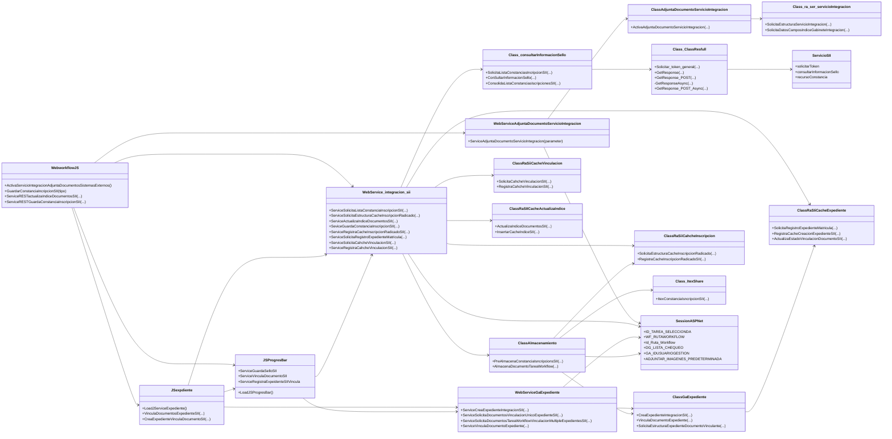

# Clases y dependencias actuales

```mermaid
classDiagram
    direction LR

    class WebworkflowJS {
      +ActivaServicioIntegracionAdjuntaDocumentosSistemasExternos()
      +GuardarConstanciaIncripcionSII(tipo)
      +ServiceRESTactualizaIndiceDocumentosSII(...)
      +ServiceRESTGuardaConstanciaInscripcionSII(...)
    }
    class JSexpdiente {
      +LoadJServiceExpediente()
      +VinculaDocumentosExpedienteSII(...)
      +CreaExpedienteVinculaDocumentoSII(...)
    }
    class JSProgresBar {
      +LoadJSProgresBar()
      +ServiceGuardaSelloSII
      +ServiceVinculaDocumentoSII
      +ServiceRegistraExpeidenteSIIVincula
    }
    class WebServiceAdjuntaDocumentoServicioIntegracion {
      +ServiceAdjuntaDocumentoServicioIntegracion(parameter)
    }
    class ClassAdjuntaDocumentoServicioIntegracion {
      +ActivaAdjuntaDocumentoServicioIntegracion(...)
    }
    class Class_ra_ser_servicioIntegracion {
      +SolicitaEstructuraServicioIntegracion(...)
      +SolicitaDatosCamposIndiceGabineteIntegracion(...)
    }
    class WebService_integracion_sii {
      +ServiceSolicitaListaConstanciaInscripcionSII(...)
      +ServiceSolicitaEstructuraCacheInscripcionRadicado(...)
      +ServiceActualizaIndiceDocumentosSII(...)
      +SeviceGuardaConstanciaInscripcionSII(...)
      +ServiceRegistraCacheInscripcionRadicadoSII(...)
      +ServiceSolicitaRegistroExpedienteMatricula(...)
      +ServiceSolicitaCahcheVinculacionSII(...)
      +ServiceRegistraCahcheVinculacionSII(...)
    }
    class WebServiceGaExpediente {
      +ServiceCreaExpedienteIntegracionSII(...)
      +ServiceSolicitaDocumentosVinculacionUnicoExpedienteSII(...)
      +ServiceSolicitaDocumentosTareaWorkflowVinculacionMultipleExpedientesSII(...)
      +ServiceVinculaDocumentoExpediente(...)
    }
    class Class_consultarInformacionSello {
      +SolicitaListaConstanciasIncripcionSII(...)
      +ConSultarInformacionSello(...)
      +ConsolidaListaConstanciasIscripcionesSII(...)
    }
    class Class_ClassResfull {
      +Solicitar_token_general(...)
      +GetResponse(...)
      +GetResponse_POST(...)
      -GetResponseAsync(...)
      +GetResponse_POST_Async(...)
    }
    class ClassGaExpediente {
      +CreaExpedienteIntegracionSII(...)
      +VinculaDocumentoExpediente(...)
      +SolicitaEstructuraExpedienteDocumentoVinculante(...)
    }
    class ClassRaSIiCacheExpediente {
      +SolicitaRegistroExpedienteMatricula(...)
      +RegistraCacheCreacionExpedienteSII(...)
      +ActualizaEstadoVinculacionDocumentoSII(...)
    }
    class ClassRaSiiCacheVinculacion {
      +SolicitaCahcheVinculacionSII(...)
      +RegistraCahcheVinculacionSII(...)
    }
    class ClassRaSIICacheActualizaIndice {
      +ActualizaIndiceDocumentosSII(...)
      +InsertarCacheIndiceSII(...)
    }
    class ClassRaSiiCahcheInscripcion {
      +SolicitaEstructuraCacheInscripcionRadicado(...)
      +RegistraCacheInscripcionRadicadoSII(...)
    }
    class ClassAlmacenamiento {
      +PreAlmacenaConstanciaIsncripcionsSII(...)
      +AlmacenaDocumentoTareaWorkflow(...)
    }
    class Class_ItexShare {
      +ItexConstanciaIsncripcionSII(...)
    }
    class SessionASPNet {
      +ID_TAREA_SELECCIONDA
      +WF_RUTAWORKFLOW
      +Id_Ruta_Workflow
      +DG_LISTA_CHEQUEO
      +GA_IDUSUARIOGESTION
      +ADJUNTAR_IMAGENES_PREDETERMINADA
    }
    class ServicioSII {
      +solicitarToken
      +consultarInformacionSello
      +recursoConstancia
    }

    WebworkflowJS --> WebServiceAdjuntaDocumentoServicioIntegracion
    WebworkflowJS --> WebService_integracion_sii
    WebworkflowJS --> JSexpdiente
    WebworkflowJS --> JSProgresBar
    JSexpdiente --> WebServiceGaExpediente
    JSexpdiente --> WebService_integracion_sii
    JSexpdiente --> JSProgresBar
    JSProgresBar --> WebServiceGaExpediente
    JSProgresBar --> WebService_integracion_sii
    WebServiceAdjuntaDocumentoServicioIntegracion --> ClassAdjuntaDocumentoServicioIntegracion
    ClassAdjuntaDocumentoServicioIntegracion --> Class_ra_ser_servicioIntegracion
    WebServiceAdjuntaDocumentoServicioIntegracion --> SessionASPNet
    WebService_integracion_sii --> Class_consultarInformacionSello
    Class_consultarInformacionSello --> Class_ClassResfull
    Class_ClassResfull --> ServicioSII
    WebService_integracion_sii --> ClassRaSIICacheActualizaIndice
    WebService_integracion_sii --> ClassRaSiiCahcheInscripcion
    WebService_integracion_sii --> ClassRaSIiCacheExpediente
    WebService_integracion_sii --> ClassRaSiiCacheVinculacion
    WebService_integracion_sii --> ClassAlmacenamiento
    WebService_integracion_sii --> SessionASPNet
    WebServiceGaExpediente --> ClassGaExpediente
    WebServiceGaExpediente --> SessionASPNet
    ClassGaExpediente --> ClassRaSIiCacheExpediente
    ClassAlmacenamiento --> Class_ItexShare
    ClassAlmacenamiento --> ClassGaExpediente
    ClassAlmacenamiento --> ClassRaSiiCahcheInscripcion
    ClassAlmacenamiento --> SessionASPNet
```
