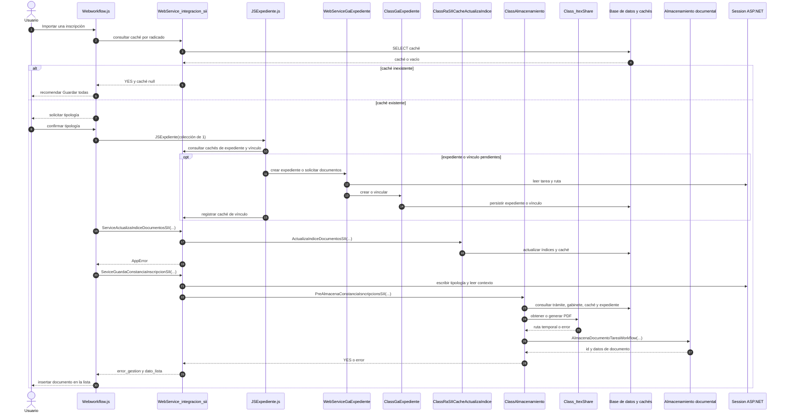

# Secuencia de guardado individual actual

```mermaid
sequenceDiagram
    autonumber
    actor U as Usuario
    participant JS as Webworkflow.js
    participant WSS as WebService_integracion_sii
    participant JSE as JSExpediente.js
    participant WSE as WebServiceGaExpediente
    participant EXP as ClassGaExpediente
    participant IDX as ClassRaSIICacheActualizaIndice
    participant ALM as ClassAlmacenamiento
    participant PDF as Class_ItexShare
    participant DB as Base de datos y cachés
    participant FS as Almacenamiento documental
    participant SES as Session ASP.NET

    U->>JS: Importar una inscripción
    JS->>WSS: consultar caché por radicado
    WSS->>DB: SELECT caché
    DB-->>WSS: caché o vacío
    alt caché inexistente
      WSS-->>JS: YES y caché null
      JS-->>U: recomendar Guardar todas
    else caché existente
      JS-->>U: solicitar tipología
      U->>JS: confirmar tipología
      JS->>JSE: JSExpdiente(colección de 1)
      JSE->>WSS: consultar cachés de expediente y vínculo
      opt expediente o vínculo pendientes
        JSE->>WSE: crear expediente o solicitar documentos
        WSE->>SES: leer tarea y ruta
        WSE->>EXP: crear o vincular
        EXP->>DB: persistir expediente o vínculo
        JSE->>WSS: registrar caché de vínculo
      end
      JS->>WSS: ServiceActualizaIndiceDocumentosSII(...)
      WSS->>IDX: ActualizaIndiceDocumentosSII(...)
      IDX->>DB: actualizar índices y caché
      WSS-->>JS: AppError
      JS->>WSS: SeviceGuardaConstanciaInscripcionSII(...)
      WSS->>SES: escribir tipología y leer contexto
      WSS->>ALM: PreAlmacenaConstanciaIsncripcionsSII(...)
      ALM->>DB: consultar trámite, gabinete, caché y expediente
      ALM->>PDF: obtener o generar PDF
      PDF-->>ALM: ruta temporal o error
      ALM->>FS: AlmacenaDocumentoTareaWorkflow(...)
      FS-->>ALM: id y datos de documento
      ALM-->>WSS: YES o error
      WSS-->>JS: error_gestion y dato_lista
      JS-->>U: insertar documento en la lista
    end
```
