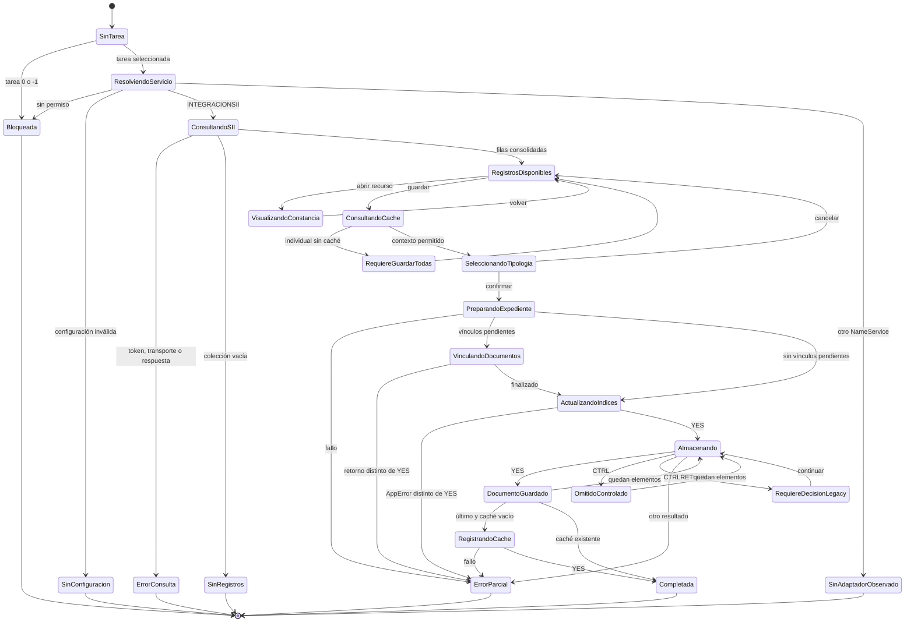

# Estados actuales

```mermaid
stateDiagram-v2
    [*] --> SinTarea
    SinTarea --> Bloqueada: tarea 0 o -1
    SinTarea --> ResolviendoServicio: tarea seleccionada
    ResolviendoServicio --> Bloqueada: sin permiso
    ResolviendoServicio --> SinConfiguracion: configuración inválida
    ResolviendoServicio --> ConsultandoSII: INTEGRACIONSII
    ResolviendoServicio --> SinAdaptadorObservado: otro NameService
    ConsultandoSII --> ErrorConsulta: token, transporte o respuesta
    ConsultandoSII --> SinRegistros: colección vacía
    ConsultandoSII --> RegistrosDisponibles: filas consolidadas
    RegistrosDisponibles --> VisualizandoConstancia: abrir recurso
    VisualizandoConstancia --> RegistrosDisponibles: volver
    RegistrosDisponibles --> ConsultandoCache: guardar
    ConsultandoCache --> RequiereGuardarTodas: individual sin caché
    RequiereGuardarTodas --> RegistrosDisponibles
    ConsultandoCache --> SeleccionandoTipologia: contexto permitido
    SeleccionandoTipologia --> RegistrosDisponibles: cancelar
    SeleccionandoTipologia --> PreparandoExpediente: confirmar
    PreparandoExpediente --> ErrorParcial: fallo
    PreparandoExpediente --> VinculandoDocumentos: vínculos pendientes
    PreparandoExpediente --> ActualizandoIndices: sin vínculos pendientes
    VinculandoDocumentos --> ErrorParcial: retorno distinto de YES
    VinculandoDocumentos --> ActualizandoIndices: finalizado
    ActualizandoIndices --> ErrorParcial: AppError distinto de YES
    ActualizandoIndices --> Almacenando: YES
    Almacenando --> DocumentoGuardado: YES
    Almacenando --> OmitidoControlado: CTRL
    Almacenando --> RequiereDecisionLegacy: CTRLRETURN
    Almacenando --> ErrorParcial: otro resultado
    DocumentoGuardado --> Almacenando: quedan elementos
    OmitidoControlado --> Almacenando: quedan elementos
    RequiereDecisionLegacy --> Almacenando: continuar
    DocumentoGuardado --> RegistrandoCache: último y caché vacío
    DocumentoGuardado --> Completada: caché existente
    RegistrandoCache --> ErrorParcial: fallo
    RegistrandoCache --> Completada: YES
    Completada --> [*]
    ErrorConsulta --> [*]
    SinRegistros --> [*]
    SinConfiguracion --> [*]
    SinAdaptadorObservado --> [*]
    Bloqueada --> [*]
    ErrorParcial --> [*]
```
