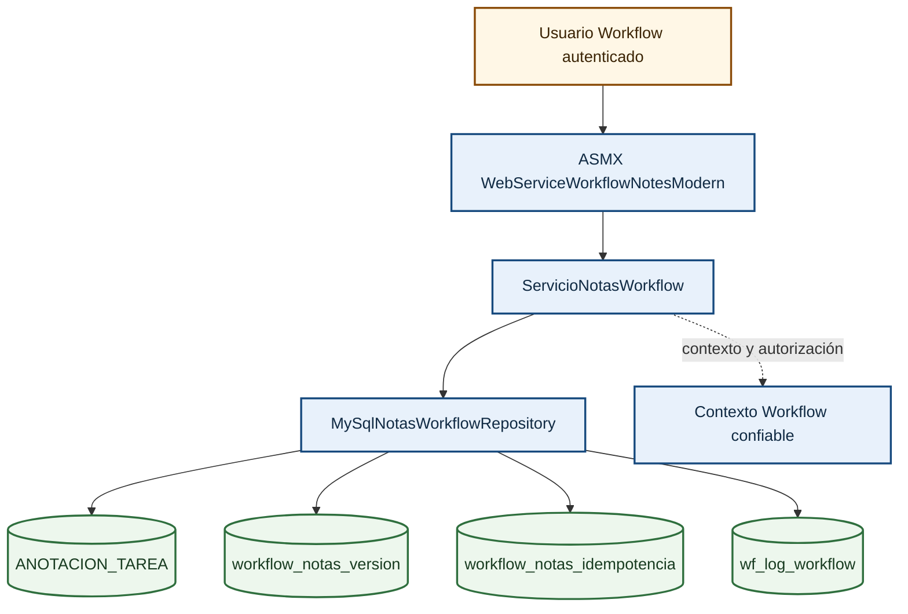

# Arquitectura DOC-42

El repositorio calcula SHA-256 en .NET. Actualización y eliminación condicionan nota y ledger en una única sentencia dentro de la transacción; la auditoría se confirma o revierte junto con la mutación.
