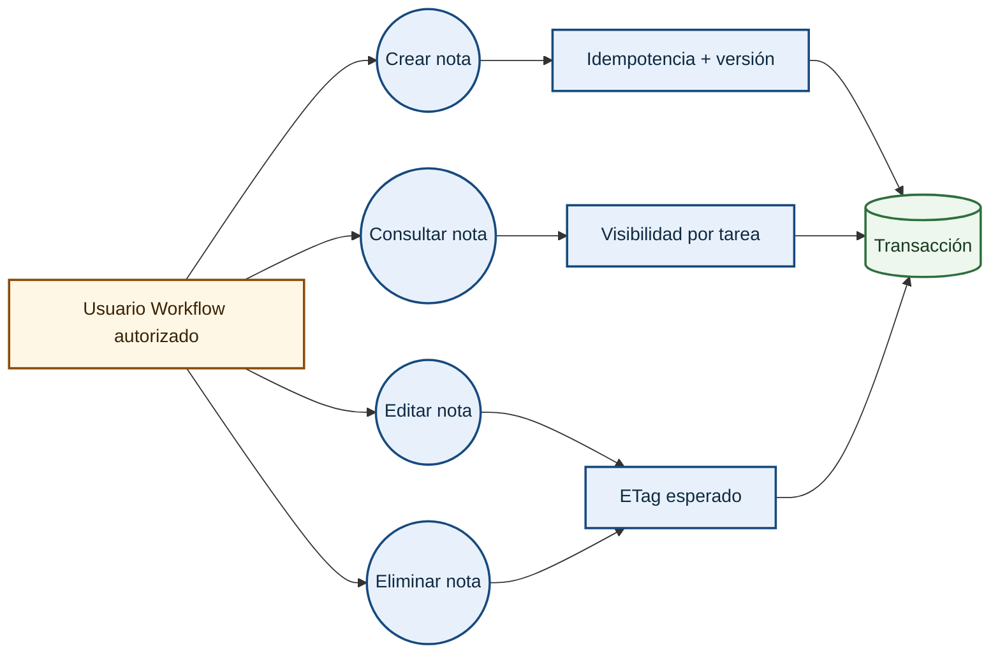

# Casos de uso DOC-42

```mermaid
flowchart LR
  U[Usuario Workflow autorizado] --> C((Crear nota))
  U --> Q((Consultar nota))
  U --> E((Editar nota))
  U --> D((Eliminar nota))
  C --> X[Idempotencia + versión]
  Q --> V[Visibilidad por tarea]
  E --> K[ETag esperado]
  D --> K
  X --> T[(Transacción)]
  V --> T
  K --> T
  classDef actor fill:#fff7e6,stroke:#8a4b08,color:#3b2405,stroke-width:2px;
  classDef use fill:#e8f1fb,stroke:#174a7e,color:#102a43,stroke-width:2px;
  classDef data fill:#edf7ed,stroke:#2f6f3e,color:#183b20,stroke-width:2px;
  class U actor; class C,Q,E,D,X,V,K use; class T data;
```

Cada caso recibe una tarea explícita; el cliente no aporta propietario, actividad, estado ni autorización.
