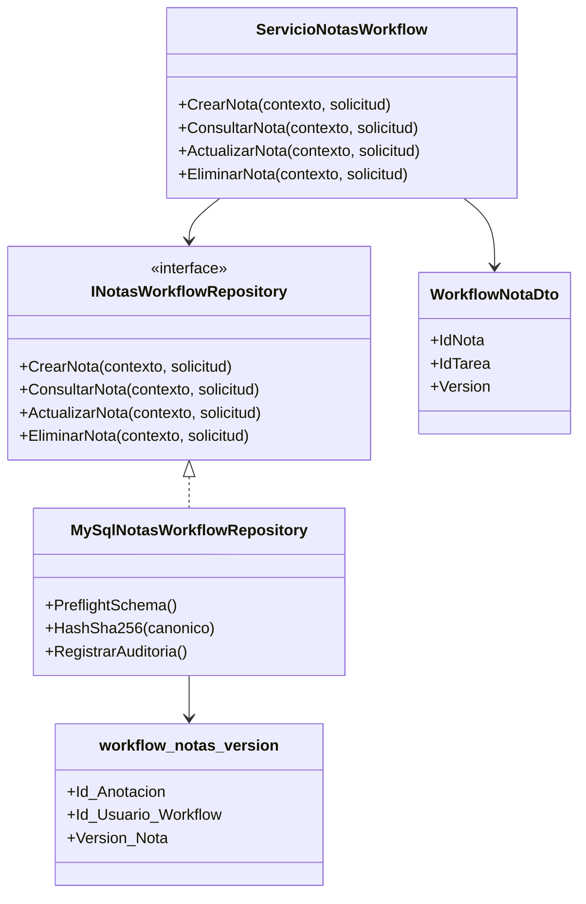

# Clases, puertos y persistencia DOC-42

```mermaid
classDiagram
  class ServicioNotasWorkflow {
    +CrearNota(contexto, solicitud)
    +ConsultarNota(contexto, solicitud)
    +ActualizarNota(contexto, solicitud)
    +EliminarNota(contexto, solicitud)
  }
  class INotasWorkflowRepository {
    <<interface>>
    +CrearNota(contexto, solicitud)
    +ConsultarNota(contexto, solicitud)
    +ActualizarNota(contexto, solicitud)
    +EliminarNota(contexto, solicitud)
  }
  class MySqlNotasWorkflowRepository {
    +PreflightSchema()
    +HashSha256(canonico)
    +RegistrarAuditoria()
  }
  class WorkflowNotaDto {
    +IdNota
    +IdTarea
    +Version
  }
  class workflow_notas_version {
    +Id_Anotacion
    +Id_Usuario_Workflow
    +Version_Nota
  }
  ServicioNotasWorkflow --> INotasWorkflowRepository
  INotasWorkflowRepository <|.. MySqlNotasWorkflowRepository
  ServicioNotasWorkflow --> WorkflowNotaDto
  MySqlNotasWorkflowRepository --> workflow_notas_version
```
