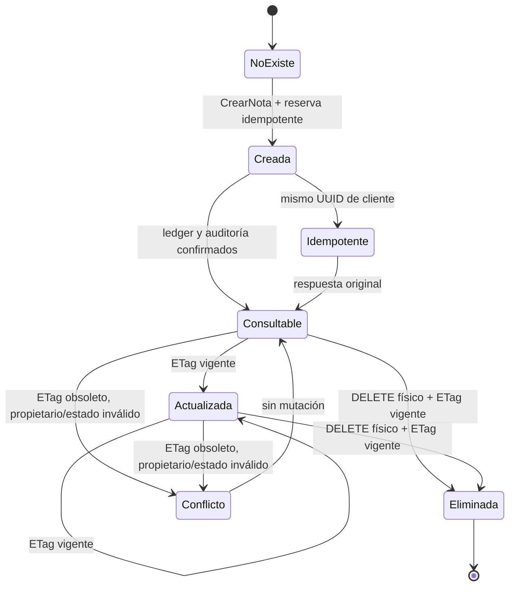

# Estados de una Nota DOC-42

```mermaid
stateDiagram-v2
  [*] --> NoExiste
  NoExiste --> Creada: CrearNota + reserva idempotente
  Creada --> Consultable: ledger y auditoría confirmados
  Consultable --> Actualizada: ETag vigente
  Consultable --> Eliminada: DELETE físico + ETag vigente
  Actualizada --> Actualizada: ETag vigente
  Actualizada --> Eliminada: DELETE físico + ETag vigente
  Consultable --> Conflicto: ETag obsoleto, propietario/estado inválido
  Actualizada --> Conflicto: ETag obsoleto, propietario/estado inválido
  Creada --> Idempotente: mismo UUID de cliente
  Idempotente --> Consultable: respuesta original
  Conflicto --> Consultable: sin mutación
  Eliminada --> [*]
```

La eliminación es física; no existe recuperación ni lectura posterior del contenido eliminado.
