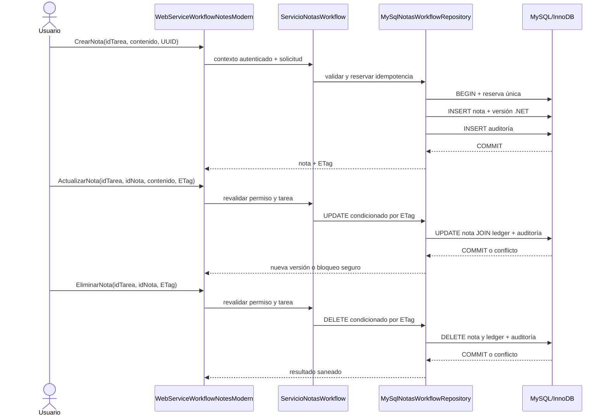

# Secuencia transaccional DOC-42

```mermaid
sequenceDiagram
  actor Usuario
  participant ASMX as WebServiceWorkflowNotesModern
  participant Servicio as ServicioNotasWorkflow
  participant Repo as MySqlNotasWorkflowRepository
  participant DB as MySQL/InnoDB
  Usuario->>ASMX: CrearNota(idTarea, contenido, UUID)
  ASMX->>Servicio: contexto autenticado + solicitud
  Servicio->>Repo: validar y reservar idempotencia
  Repo->>DB: BEGIN + reserva única
  Repo->>DB: INSERT nota + versión .NET
  Repo->>DB: INSERT auditoría
  DB-->>Repo: COMMIT
  Repo-->>ASMX: nota + ETag
  Usuario->>ASMX: ActualizarNota(idTarea, idNota, contenido, ETag)
  ASMX->>Servicio: revalidar permiso y tarea
  Servicio->>Repo: UPDATE condicionado por ETag
  Repo->>DB: UPDATE nota JOIN ledger + auditoría
  DB-->>Repo: COMMIT o conflicto
  Repo-->>ASMX: nueva versión o bloqueo seguro
  Usuario->>ASMX: EliminarNota(idTarea, idNota, ETag)
  ASMX->>Servicio: revalidar permiso y tarea
  Servicio->>Repo: DELETE condicionado por ETag
  Repo->>DB: DELETE nota y ledger + auditoría
  DB-->>Repo: COMMIT o conflicto
  Repo-->>ASMX: resultado saneado
```
