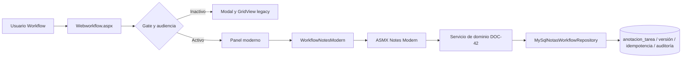

# Diagrama de arquitectura

```mermaid
flowchart LR
  U[Usuario Workflow] --> P[Webworkflow.aspx]
  G{Gate y audiencia} -->|Inactivo| L[Modal y GridView legacy]
  G -->|Activo| M[Panel moderno]
  P --> G
  M --> J[WorkflowNotesModern]
  J --> A[ASMX Notes Modern]
  A --> S[Servicio de dominio DOC-42]
  S --> R[MySqlNotasWorkflowRepository]
  R --> D[(anotacion_tarea / versión / idempotencia / auditoría)]
```
