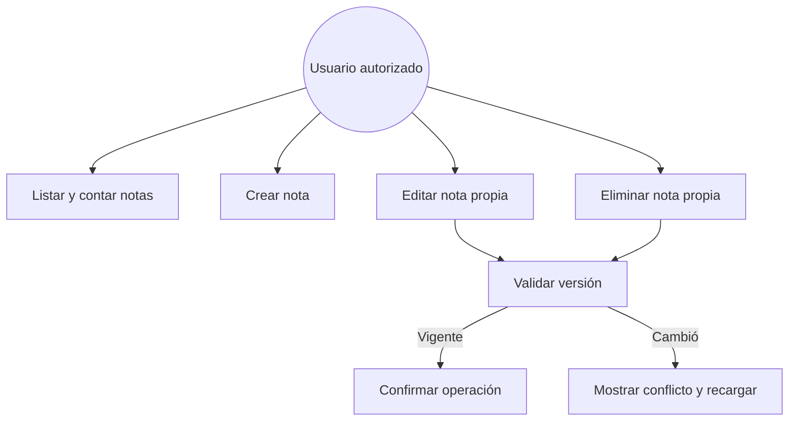

# Casos de uso

```mermaid
flowchart TB
  U((Usuario autorizado)) --> C1[Listar y contar notas]
  U --> C2[Crear nota]
  U --> C3[Editar nota propia]
  U --> C4[Eliminar nota propia]
  C3 --> V[Validar versión]
  C4 --> V
  V -->|Vigente| OK[Confirmar operación]
  V -->|Cambió| CF[Mostrar conflicto y recargar]
```
