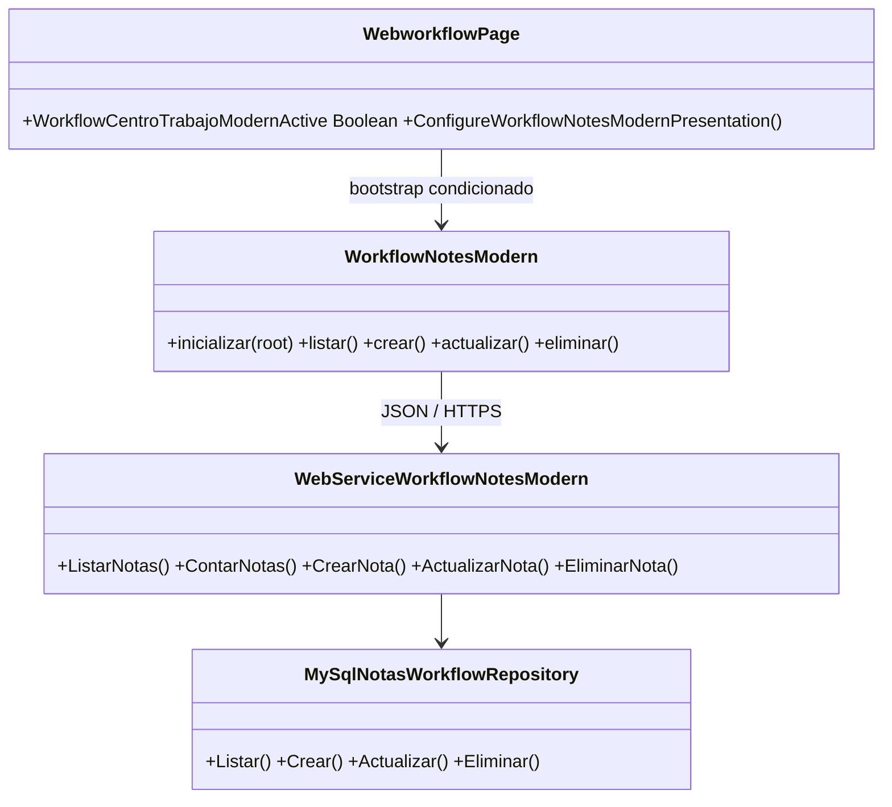

# Diagrama de clases y componentes

```mermaid
classDiagram
  class WebworkflowPage { +WorkflowCentroTrabajoModernActive Boolean +ConfigureWorkflowNotesModernPresentation() }
  class WorkflowNotesModern { +inicializar(root) +listar() +crear() +actualizar() +eliminar() }
  class WebServiceWorkflowNotesModern { +ListarNotas() +ContarNotas() +CrearNota() +ActualizarNota() +EliminarNota() }
  class MySqlNotasWorkflowRepository { +Listar() +Crear() +Actualizar() +Eliminar() }
  WebworkflowPage --> WorkflowNotesModern : bootstrap condicionado
  WorkflowNotesModern --> WebServiceWorkflowNotesModern : JSON / HTTPS
  WebServiceWorkflowNotesModern --> MySqlNotasWorkflowRepository
```
