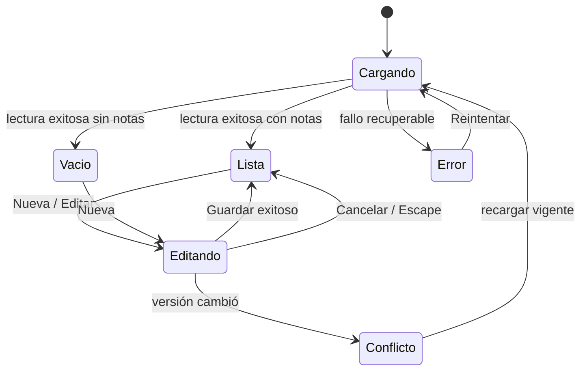

# Diagrama de estados

```mermaid
stateDiagram-v2
  [*] --> Cargando
  Cargando --> Lista: lectura exitosa con notas
  Cargando --> Vacio: lectura exitosa sin notas
  Cargando --> Error: fallo recuperable
  Error --> Cargando: Reintentar
  Lista --> Editando: Nueva / Editar
  Vacio --> Editando: Nueva
  Editando --> Lista: Guardar exitoso
  Editando --> Conflicto: versión cambió
  Conflicto --> Cargando: recargar vigente
  Editando --> Lista: Cancelar / Escape
```
