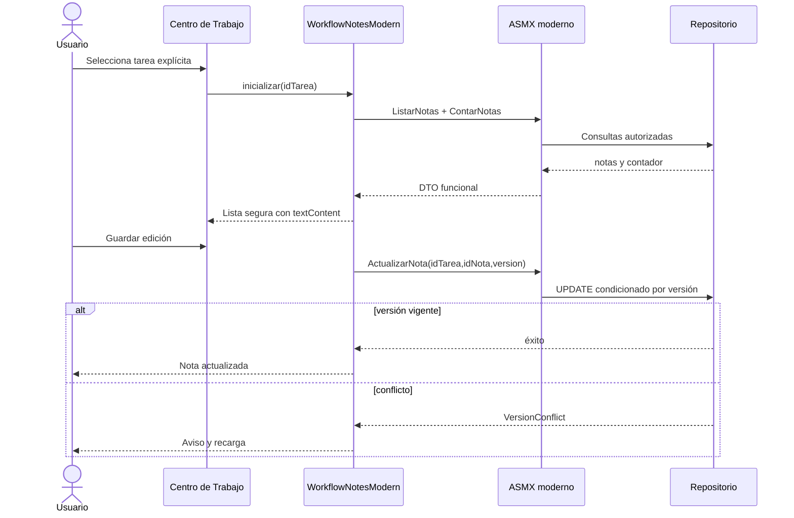

# Diagrama de secuencia

```mermaid
sequenceDiagram
  actor U as Usuario
  participant UI as Centro de Trabajo
  participant JS as WorkflowNotesModern
  participant API as ASMX moderno
  participant DB as Repositorio
  U->>UI: Selecciona tarea explícita
  UI->>JS: inicializar(idTarea)
  JS->>API: ListarNotas + ContarNotas
  API->>DB: Consultas autorizadas
  DB-->>API: notas y contador
  API-->>JS: DTO funcional
  JS-->>UI: Lista segura con textContent
  U->>UI: Guardar edición
  JS->>API: ActualizarNota(idTarea,idNota,version)
  API->>DB: UPDATE condicionado por versión
  alt versión vigente
    DB-->>JS: éxito
    JS-->>U: Nota actualizada
  else conflicto
    DB-->>JS: VersionConflict
    JS-->>U: Aviso y recarga
  end
```
