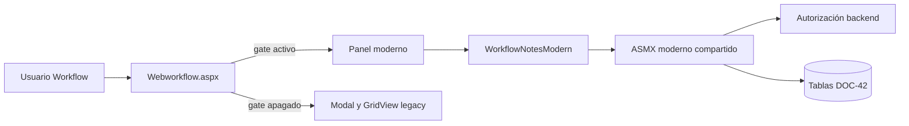

# Arquitectura

```mermaid
flowchart LR
  U[Usuario Workflow] --> P[Webworkflow.aspx]
  P -->|gate activo| M[Panel moderno]
  P -->|gate apagado| L[Modal y GridView legacy]
  M --> J[WorkflowNotesModern]
  J --> A[ASMX moderno compartido]
  A --> Z[Autorización backend]
  A --> D[(Tablas DOC-42)]
```
