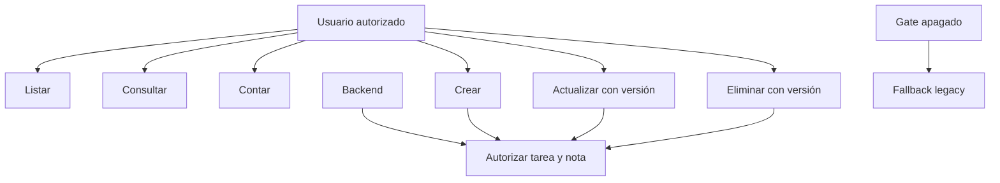

# Casos de uso

```mermaid
flowchart TB
  U[Usuario autorizado] --> LI[Listar]
  U --> CO[Consultar]
  U --> CN[Contar]
  U --> CR[Crear]
  U --> AC[Actualizar con versión]
  U --> EL[Eliminar con versión]
  B[Backend] --> AU[Autorizar tarea y nota]
  CR --> AU
  AC --> AU
  EL --> AU
  F[Gate apagado] --> LG[Fallback legacy]
```
