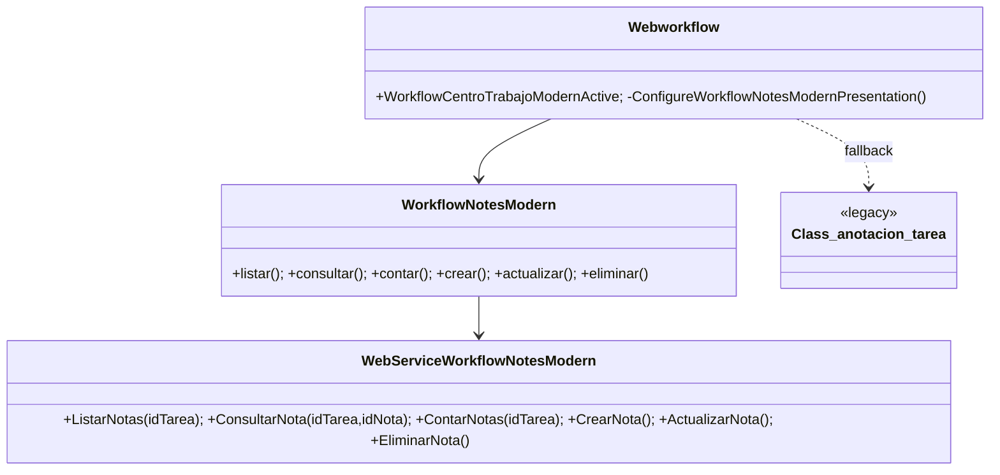

# Clases y componentes

```mermaid
classDiagram
  class Webworkflow { +WorkflowCentroTrabajoModernActive; -ConfigureWorkflowNotesModernPresentation() }
  class WorkflowNotesModern { +listar(); +consultar(); +contar(); +crear(); +actualizar(); +eliminar() }
  class WebServiceWorkflowNotesModern { +ListarNotas(idTarea); +ConsultarNota(idTarea,idNota); +ContarNotas(idTarea); +CrearNota(); +ActualizarNota(); +EliminarNota() }
  class Class_anotacion_tarea { <<legacy>> }
  Webworkflow --> WorkflowNotesModern
  WorkflowNotesModern --> WebServiceWorkflowNotesModern
  Webworkflow ..> Class_anotacion_tarea : fallback
```
