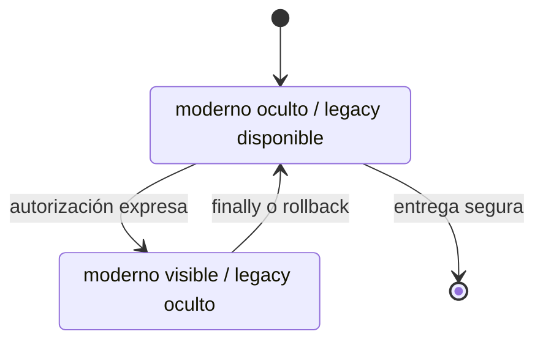

# Estados

```mermaid
stateDiagram-v2
  [*] --> GateApagado
  GateApagado: moderno oculto / legacy disponible
  GateApagado --> GateTemporal: autorización expresa
  GateTemporal: moderno visible / legacy oculto
  GateTemporal --> GateApagado: finally o rollback
  GateApagado --> [*]: entrega segura
```
