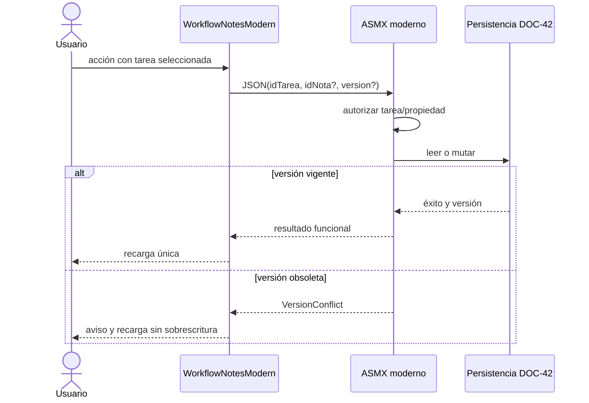

# Secuencia

```mermaid
sequenceDiagram
  actor U as Usuario
  participant UI as WorkflowNotesModern
  participant API as ASMX moderno
  participant DB as Persistencia DOC-42
  U->>UI: acción con tarea seleccionada
  UI->>API: JSON(idTarea, idNota?, version?)
  API->>API: autorizar tarea/propiedad
  API->>DB: leer o mutar
  alt versión vigente
    DB-->>API: éxito y versión
    API-->>UI: resultado funcional
    UI-->>U: recarga única
  else versión obsoleta
    API-->>UI: VersionConflict
    UI-->>U: aviso y recarga sin sobrescritura
  end
```
