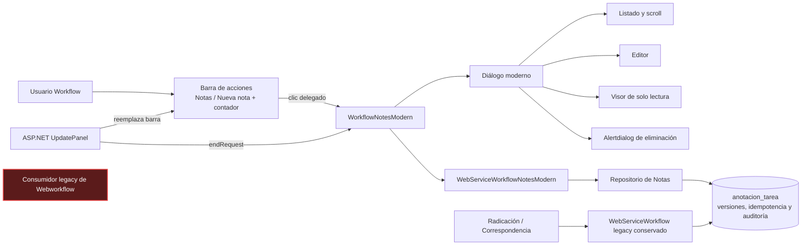

# Arquitectura

```mermaid
flowchart LR
  U[Usuario Workflow] --> BAR[Barra de acciones<br/>Notas / Nueva nota + contador]
  UP[ASP.NET UpdatePanel] -->|reemplaza barra| BAR
  BAR -->|clic delegado| JS[WorkflowNotesModern]
  UP -->|endRequest| JS
  JS --> MODAL[Diálogo moderno]
  MODAL --> LISTA[Listado y scroll]
  MODAL --> EDITOR[Editor]
  MODAL --> VISOR[Visor de solo lectura]
  MODAL --> CONF[Alertdialog de eliminación]
  JS --> ASMX[WebServiceWorkflowNotesModern]
  ASMX --> REPO[Repositorio de Notas]
  REPO --> DB[(anotacion_tarea<br/>versiones, idempotencia y auditoría)]
  RAD[Radicación / Correspondencia] --> LEG[WebServiceWorkflow legacy conservado]
  LEG --> DB
  OLD[Consumidor legacy de Webworkflow]:::removed
  classDef removed fill:#5b1b1b,color:#fff,stroke:#ef4444,stroke-width:2px;
```
