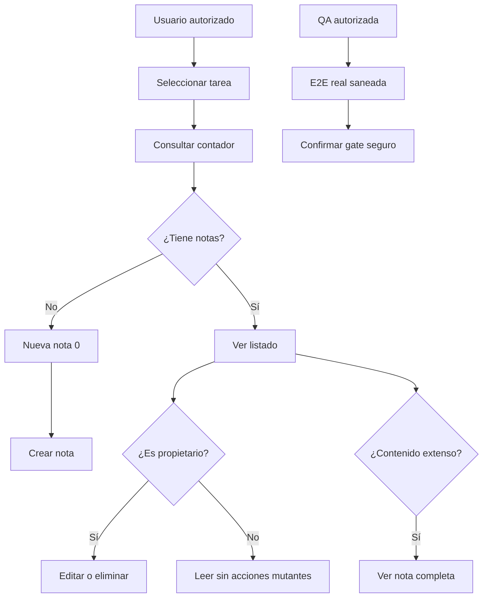

# Casos de uso

```mermaid
flowchart TB
  A[Usuario autorizado] --> S[Seleccionar tarea]
  S --> C[Consultar contador]
  C --> Z{¿Tiene notas?}
  Z -- No --> N[Nueva nota 0]
  N --> CREAR[Crear nota]
  Z -- Sí --> L[Ver listado]
  L --> P{¿Es propietario?}
  P -- Sí --> E[Editar o eliminar]
  P -- No --> R[Leer sin acciones mutantes]
  L --> X{¿Contenido extenso?}
  X -- Sí --> V[Ver nota completa]
  QA[QA autorizada] --> E2E[E2E real saneada]
  E2E --> G[Confirmar gate seguro]
```
