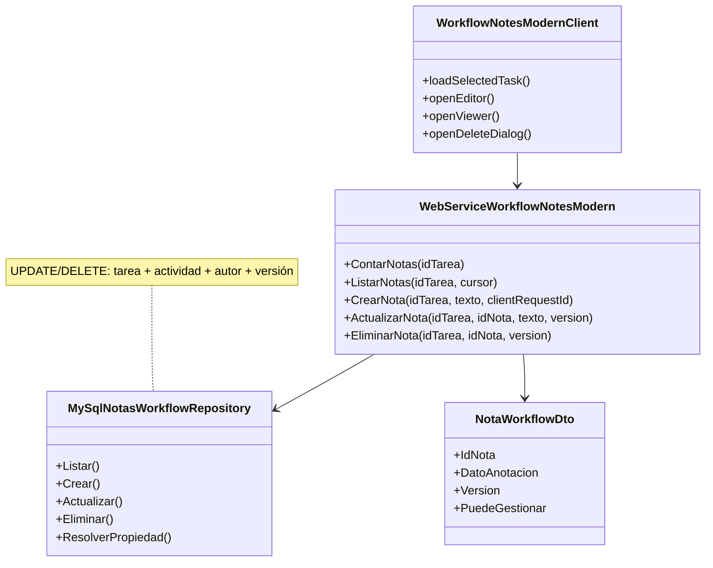

# Clases y contratos

```mermaid
classDiagram
  class NotaWorkflowDto {
    +IdNota
    +DatoAnotacion
    +Version
    +PuedeGestionar
  }
  class WebServiceWorkflowNotesModern {
    +ContarNotas(idTarea)
    +ListarNotas(idTarea, cursor)
    +CrearNota(idTarea, texto, clientRequestId)
    +ActualizarNota(idTarea, idNota, texto, version)
    +EliminarNota(idTarea, idNota, version)
  }
  class MySqlNotasWorkflowRepository {
    +Listar()
    +Crear()
    +Actualizar()
    +Eliminar()
    +ResolverPropiedad()
  }
  class WorkflowNotesModernClient {
    +loadSelectedTask()
    +openEditor()
    +openViewer()
    +openDeleteDialog()
  }
  WorkflowNotesModernClient --> WebServiceWorkflowNotesModern
  WebServiceWorkflowNotesModern --> MySqlNotasWorkflowRepository
  WebServiceWorkflowNotesModern --> NotaWorkflowDto
  note for MySqlNotasWorkflowRepository "UPDATE/DELETE: tarea + actividad + autor + versión"
```
