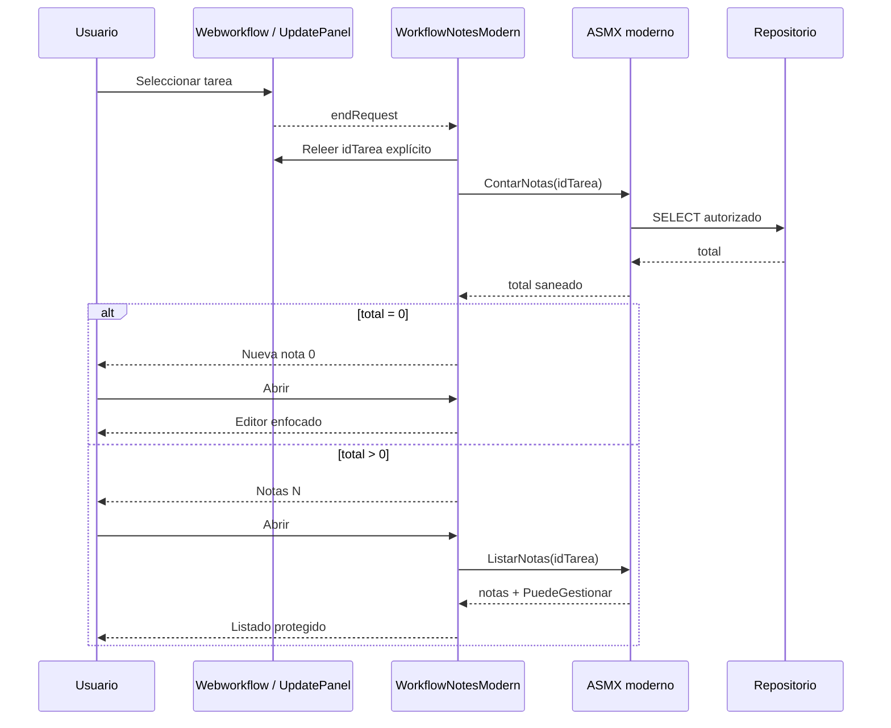

# Secuencia operativa

```mermaid
sequenceDiagram
  participant U as Usuario
  participant UI as Webworkflow / UpdatePanel
  participant JS as WorkflowNotesModern
  participant API as ASMX moderno
  participant DB as Repositorio
  U->>UI: Seleccionar tarea
  UI-->>JS: endRequest
  JS->>UI: Releer idTarea explícito
  JS->>API: ContarNotas(idTarea)
  API->>DB: SELECT autorizado
  DB-->>API: total
  API-->>JS: total saneado
  alt total = 0
    JS-->>U: Nueva nota 0
    U->>JS: Abrir
    JS-->>U: Editor enfocado
  else total > 0
    JS-->>U: Notas N
    U->>JS: Abrir
    JS->>API: ListarNotas(idTarea)
    API-->>JS: notas + PuedeGestionar
    JS-->>U: Listado protegido
  end
```
