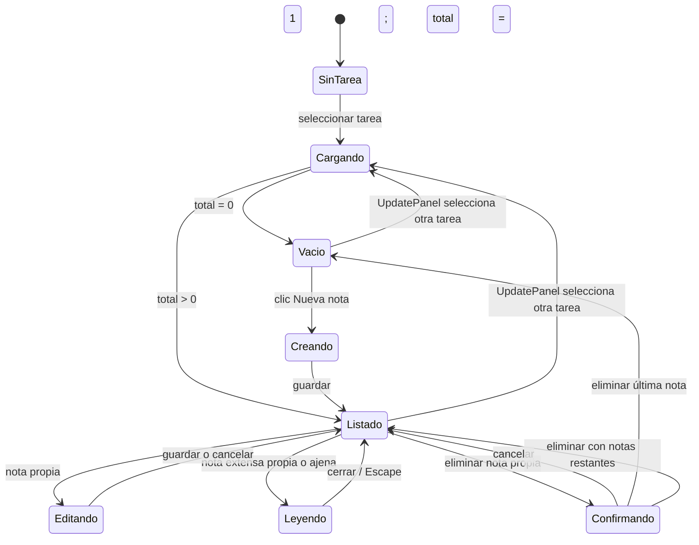

# Estados

```mermaid
stateDiagram-v2
  [*] --> SinTarea
  SinTarea --> Cargando: seleccionar tarea
  Cargando --> Vacio: total = 0
  Cargando --> Listado: total > 0
  Vacio --> Creando: clic Nueva nota
  Creando --> Listado: guardar; total = 1
  Listado --> Editando: nota propia
  Listado --> Leyendo: nota extensa propia o ajena
  Listado --> Confirmando: eliminar nota propia
  Editando --> Listado: guardar o cancelar
  Leyendo --> Listado: cerrar / Escape
  Confirmando --> Listado: cancelar
  Confirmando --> Vacio: eliminar última nota
  Confirmando --> Listado: eliminar con notas restantes
  Listado --> Cargando: UpdatePanel selecciona otra tarea
  Vacio --> Cargando: UpdatePanel selecciona otra tarea
```
