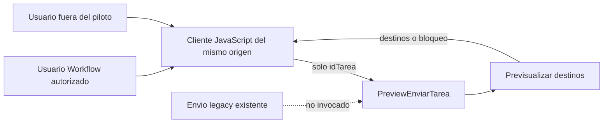

# Casos de uso

```mermaid
flowchart LR
    Autorizado[Usuario Workflow autorizado]
    NoAutorizado[Usuario fuera del piloto]
    Frontend[Cliente JavaScript del mismo origen]
    ASMX[PreviewEnviarTarea]
    Preview[Previsualizar destinos]
    Legacy[Envio legacy existente]

    Autorizado --> Frontend
    NoAutorizado --> Frontend
    Frontend -->|solo idTarea| ASMX
    ASMX --> Preview
    Preview -->|destinos o bloqueo| Frontend
    Legacy -. no invocado .-> ASMX
```

El caso de uso termina en una respuesta JSON. Elegir, confirmar o ejecutar un destino no pertenece a DOC-10.
