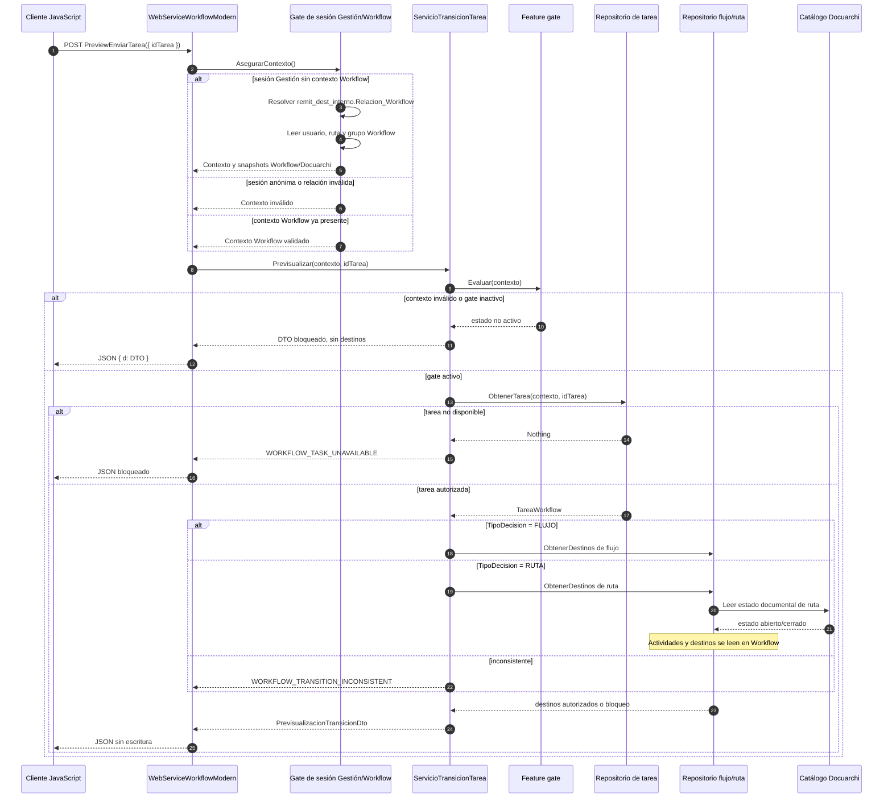

# Secuencia de previsualización

```mermaid
sequenceDiagram
    autonumber
    participant C as Cliente JavaScript
    participant A as WebServiceWorkflowModern
    participant SG as Gate de sesión Gestión/Workflow
    participant S as ServicioTransicionTarea
    participant G as Feature gate
    participant T as Repositorio de tarea
    participant R as Repositorio flujo/ruta
    participant D as Catálogo Docuarchi

    C->>A: POST PreviewEnviarTarea({ idTarea })
    A->>SG: AsegurarContexto()
    alt sesión Gestión sin contexto Workflow
        SG->>SG: Resolver remit_dest_interno.Relacion_Workflow
        SG->>SG: Leer usuario, ruta y grupo Workflow
        SG-->>A: Contexto y snapshots Workflow/Docuarchi
    else sesión anónima o relación inválida
        SG-->>A: Contexto inválido
    else contexto Workflow ya presente
        SG-->>A: Contexto Workflow validado
    end
    A->>S: Previsualizar(contexto, idTarea)
    S->>G: Evaluar(contexto)
    alt contexto inválido o gate inactivo
        G-->>S: estado no activo
        S-->>A: DTO bloqueado, sin destinos
        A-->>C: JSON { d: DTO }
    else gate activo
        S->>T: ObtenerTarea(contexto, idTarea)
        alt tarea no disponible
            T-->>S: Nothing
            S-->>A: WORKFLOW_TASK_UNAVAILABLE
            A-->>C: JSON bloqueado
        else tarea autorizada
            T-->>S: TareaWorkflow
            alt TipoDecision = FLUJO
                S->>R: ObtenerDestinos de flujo
            else TipoDecision = RUTA
                S->>R: ObtenerDestinos de ruta
                R->>D: Leer estado documental de ruta
                D-->>R: estado abierto/cerrado
                Note over R: Actividades y destinos se leen en Workflow
            else inconsistente
                S-->>A: WORKFLOW_TRANSITION_INCONSISTENT
            end
            R-->>S: destinos autorizados o bloqueo
            S-->>A: PrevisualizacionTransicionDto
            A-->>C: JSON sin escritura
        end
    end
```

Este archivo usa extensión `.md` para que el visor renderice el bloque Mermaid. El archivo `.mmd` anterior se retiró porque el visor lo mostraba como texto fuente.
