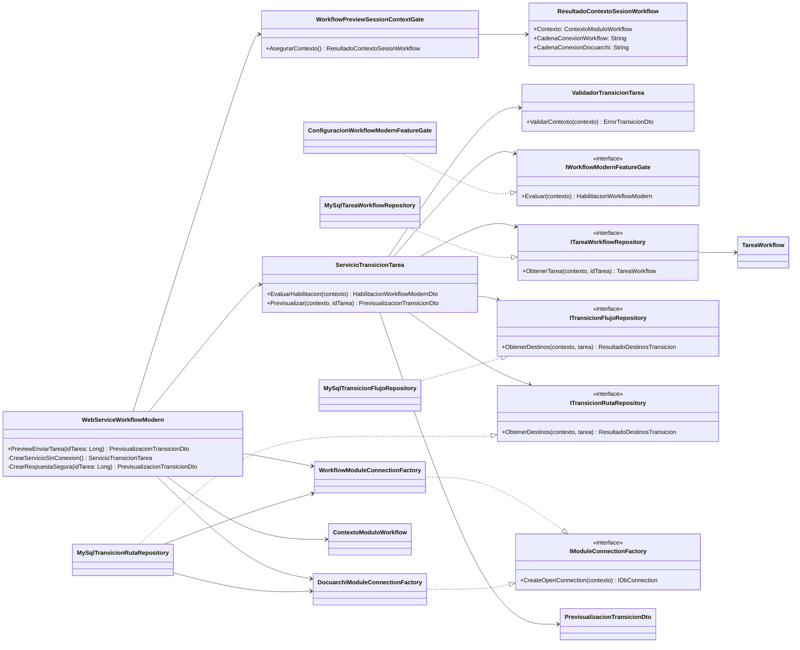

# Clases y componentes

Los puertos apuntan desde Application a Infrastructure. En ruta, Workflow aporta tarea/configuración/destinos y Docuarchi aporta exclusivamente el estado documental. Ninguna relación llega al ejecutor legacy.
