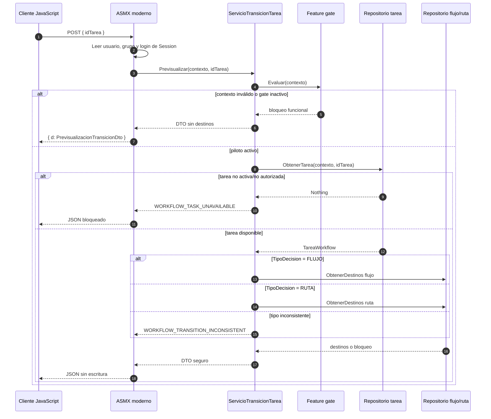

# Secuencia de previsualización

```mermaid
sequenceDiagram
    autonumber
    participant C as Cliente JavaScript
    participant A as ASMX moderno
    participant S as ServicioTransicionTarea
    participant G as Feature gate
    participant T as Repositorio tarea
    participant D as Repositorio flujo/ruta

    C->>A: POST { idTarea }
    A->>A: Leer usuario, grupo y login de Session
    A->>S: Previsualizar(contexto, idTarea)
    S->>G: Evaluar(contexto)
    alt contexto inválido o gate inactivo
        G-->>S: bloqueo funcional
        S-->>A: DTO sin destinos
        A-->>C: { d: PrevisualizacionTransicionDto }
    else piloto activo
        S->>T: ObtenerTarea(contexto, idTarea)
        alt tarea no activa/no autorizada
            T-->>S: Nothing
            S-->>A: WORKFLOW_TASK_UNAVAILABLE
            A-->>C: JSON bloqueado
        else tarea disponible
            T-->>S: TareaWorkflow
            alt TipoDecision = FLUJO
                S->>D: ObtenerDestinos flujo
            else TipoDecision = RUTA
                S->>D: ObtenerDestinos ruta
            else tipo inconsistente
                S-->>A: WORKFLOW_TRANSITION_INCONSISTENT
            end
            D-->>S: destinos o bloqueo
            S-->>A: DTO seguro
            A-->>C: JSON sin escritura
        end
    end
```
