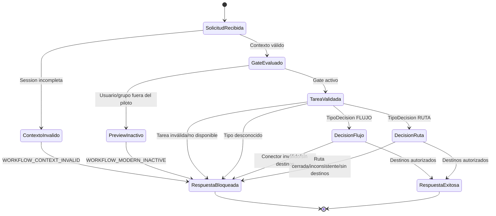

# Estados de la solicitud

```mermaid
stateDiagram-v2
    [*] --> SolicitudRecibida
    SolicitudRecibida --> ContextoInvalido: Session incompleta
    SolicitudRecibida --> GateEvaluado: Contexto válido
    ContextoInvalido --> RespuestaBloqueada: WORKFLOW_CONTEXT_INVALID
    GateEvaluado --> PreviewInactivo: Usuario/grupo fuera del piloto
    PreviewInactivo --> RespuestaBloqueada: WORKFLOW_MODERN_INACTIVE
    GateEvaluado --> TareaValidada: Gate activo
    TareaValidada --> RespuestaBloqueada: Tarea inválida/no disponible
    TareaValidada --> DecisionFlujo: TipoDecision FLUJO
    TareaValidada --> DecisionRuta: TipoDecision RUTA
    TareaValidada --> RespuestaBloqueada: Tipo desconocido
    DecisionFlujo --> RespuestaBloqueada: Conector inválido/sin destinos
    DecisionRuta --> RespuestaBloqueada: Ruta cerrada/inconsistente/sin destinos
    DecisionFlujo --> RespuestaExitosa: Destinos autorizados
    DecisionRuta --> RespuestaExitosa: Destinos autorizados
    RespuestaBloqueada --> [*]
    RespuestaExitosa --> [*]
```

No existe un estado de ejecución ni de transición: todos los estados terminales devuelven JSON de solo lectura.
