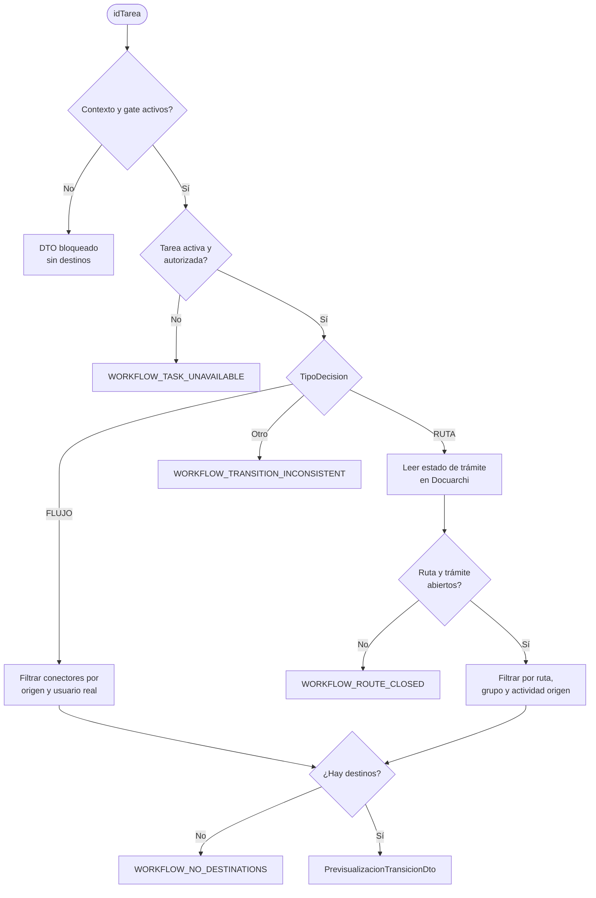

# Decisión de flujo o ruta

Todos los filtros reciben el contexto resuelto en servidor; el flujo nunca toma permisos ni origen desde el navegador. Para `RUTA`, solo el estado del trámite se consulta en Docuarchi; los destinos se mantienen en Workflow.
