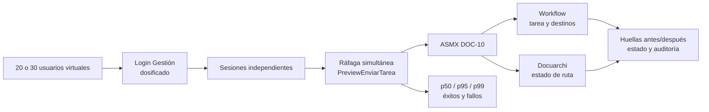

# Carga autenticada de preview

```mermaid
flowchart LR
    C[20 o 30 usuarios virtuales] --> L[Login Gestión<br/>dosificado]
    L --> S[Sesiones independientes]
    S --> B[Ráfaga simultánea<br/>PreviewEnviarTarea]
    B --> A[ASMX DOC-10]
    A --> W[Workflow<br/>tarea y destinos]
    A --> D[Docuarchi<br/>estado de ruta]
    B --> M[p50 / p95 / p99<br/>éxitos y fallos]
    W --> H[Huellas antes/después<br/>estado y auditoría]
    D --> H
```

El login se mide y reporta por separado. La decisión sobre asincronía se sustenta en la ráfaga al ASMX, las métricas del host y la ausencia de mutaciones.
