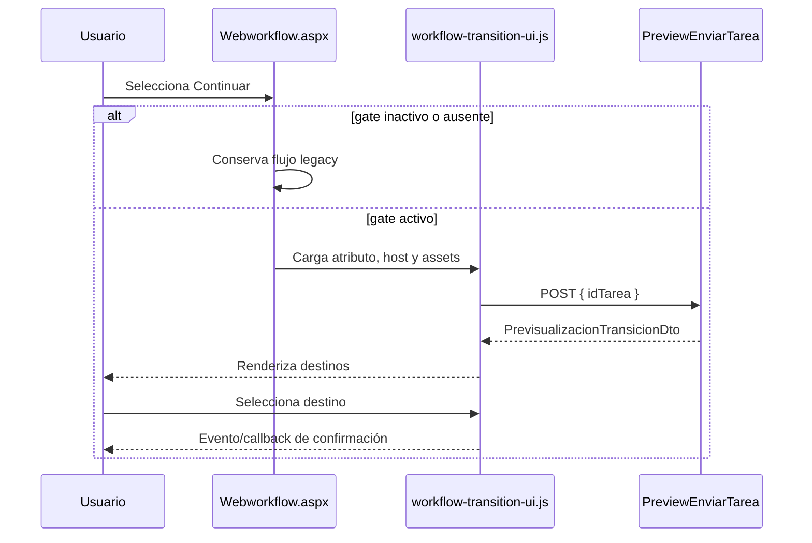

# Flujo, seguridad y accesibilidad

## Secuencia

La fuente Mermaid equivalente está en [Diagramas/activacion-y-modal.mmd](Diagramas/activacion-y-modal.mmd).

## Límites de seguridad

- El feature gate se evalúa en servidor y el ASMX lo valida de nuevo.
- `fetch` usa `credentials: 'same-origin'`; no se envían datos de autorización desde el navegador.
- El renderizado usa `createElement` y `textContent`; no se inserta HTML de negocio ni se muestran excepciones, SQL, Session o credenciales.
- Abrir o seleccionar no invoca ejecución de envío, cambios de estado, correo ni auditoría.
- El error del servicio se normaliza a un mensaje controlado y recuperable.

## Accesibilidad y compatibilidad

- El diálogo tiene nombre accesible, foco inicial en Cerrar, Escape, foco atrapado y retorno al enlace disparador.
- La región de estado usa `role="status"` y `aria-live="polite"`.
- El foco visible mantiene alto contraste y la tabla se transforma en tarjetas por debajo de 768 px.
- Con la bandera inactiva, ni JS ni CSS modernos se cargan; la vista `GridView_envia_flujo` y su modal permanecen sin cambios.

## Riesgos y rollback

El único cambio de integración al enlace es un atributo de datos. Al desactivar `WorkflowCentroTrabajoModernActive` para el piloto, el servidor deja de emitir la UI moderna en la siguiente carga. No hay migraciones ni datos que revertir.
