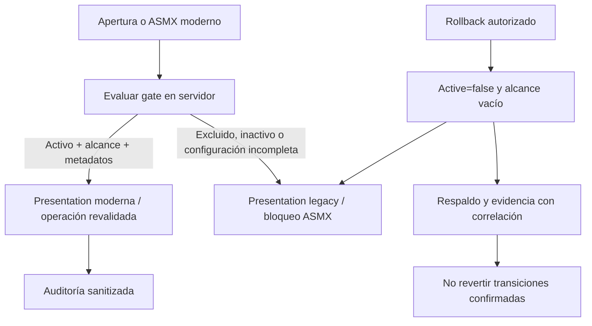

# Gate y rollback — DOC-14

```mermaid
flowchart TD
    A[Apertura o ASMX moderno] --> B[Evaluar gate en servidor]
    B -->|Activo + alcance + metadatos| C[Presentation moderna / operación revalidada]
    B -->|Excluido, inactivo o configuración incompleta| D[Presentation legacy / bloqueo ASMX]
    C --> E[Auditoría sanitizada]
    R[Rollback autorizado] --> S[Active=false y alcance vacío]
    S --> D
    S --> T[Respaldo y evidencia con correlación]
    T --> U[No revertir transiciones confirmadas]
```
