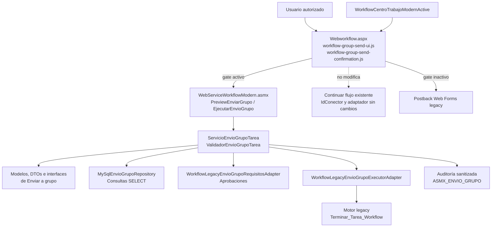

# Arquitectura de componentes

La infraestructura es la única capa que conoce consultas SQL y la llamada al motor legado. Los contratos de dominio y aplicación no exponen `Page`, `Session` ni `IdConector`.
