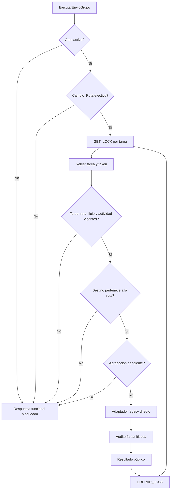

# Controles de validación y ejecución

Solo el adaptador legacy ejecuta la transición. Las consultas de destinos y validación son de solo lectura; los bloqueos funcionales no cambian tarea, estado ni auditoría.
