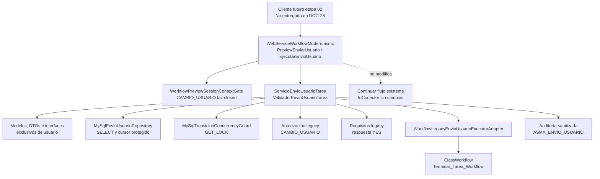

# Arquitectura de componentes

La infraestructura es la única capa que conoce SQL, permisos legacy, requisitos y motor. Los contratos de dominio y ASMX no exponen `Page`, `Session` ni `IdConector`.
