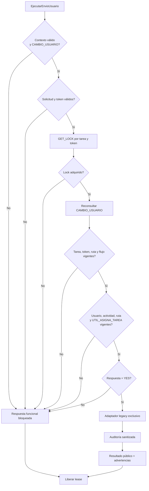

# Controles de validación y ejecución

Preview no recorre este flujo: usa solo las validaciones y lecturas necesarias para presentar una página de destinos autorizados. Ningún bloqueo invoca el adaptador mutante.
