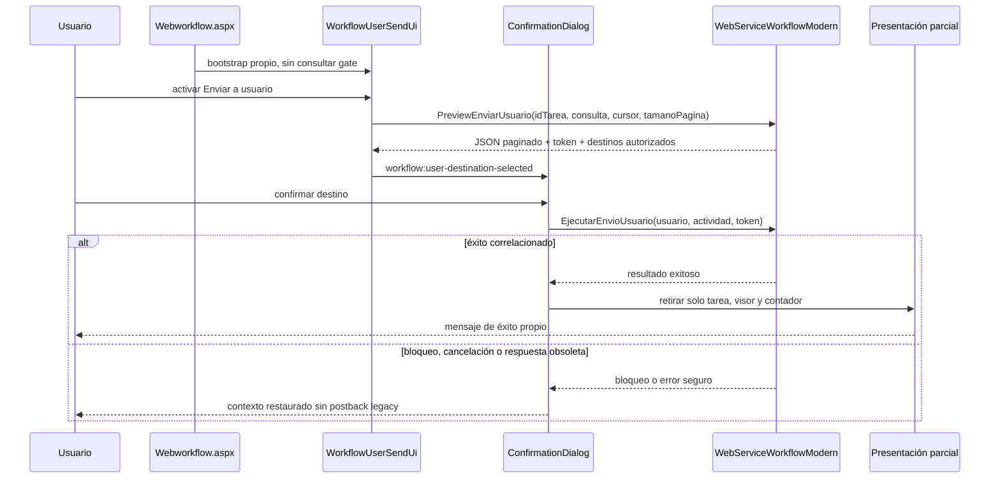

# DOC-29 — Secuencia de interfaz moderna de Enviar a usuario

La secuencia no contiene `IdConector`, controles ocultos, `Cambia_Estado`, `After_envio_usuario_workflow` ni reasignación de respuesta. `WorkflowTransitionUi` permanece fuera de este recorrido.
