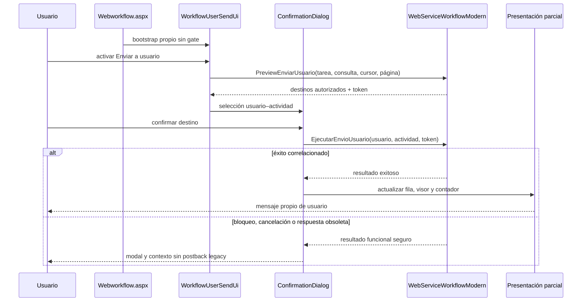

# Secuencia moderna de Enviar a usuario

```mermaid
sequenceDiagram
    participant U as Usuario
    participant P as Webworkflow.aspx
    participant UI as WorkflowUserSendUi
    participant C as ConfirmationDialog
    participant S as WebServiceWorkflowModern
    participant V as Presentación parcial

    P->>UI: bootstrap propio sin gate
    U->>UI: activar Enviar a usuario
    UI->>S: PreviewEnviarUsuario(tarea, consulta, cursor, página)
    S-->>UI: destinos autorizados + token
    UI->>C: selección usuario–actividad
    U->>C: confirmar destino
    C->>S: EjecutarEnvioUsuario(usuario, actividad, token)
    alt éxito correlacionado
        S-->>C: resultado exitoso
        C->>V: actualizar fila, visor y contador
        V-->>U: mensaje propio de usuario
    else bloqueo, cancelación o respuesta obsoleta
        S-->>C: resultado funcional seguro
        C-->>U: modal y contexto sin postback legacy
    end
```

La secuencia no contiene `IdConector`, controles ocultos, reasignación de respuesta ni `After_envio_usuario_workflow`.
