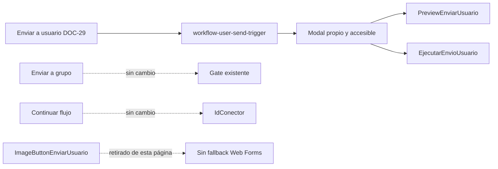

# Alcance y compatibilidad

El comando de usuario se registra para todo contexto Workflow válido y no lee ni modifica el gate de las otras operaciones. Grupo y Continuar flujo conservan su contrato y su ciclo de vida.
