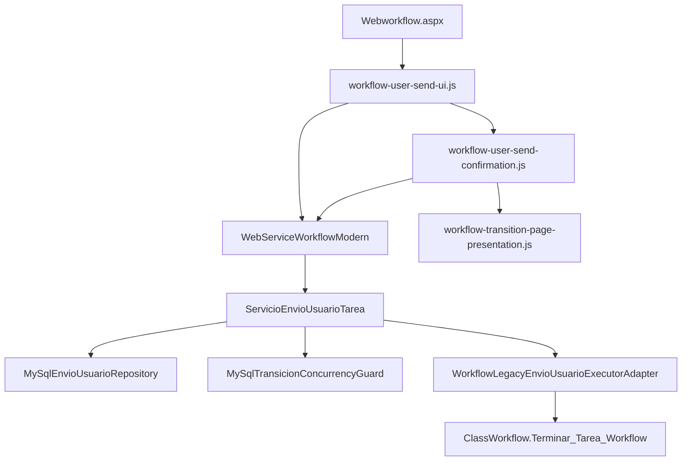

# Arquitectura de componentes

```mermaid
flowchart TB
    Page[Webworkflow.aspx]
    UI[workflow-user-send-ui.js]
    Confirm[workflow-user-send-confirmation.js]
    Present[workflow-transition-page-presentation.js]
    ASMX[WebServiceWorkflowModern]
    Service[ServicioEnvioUsuarioTarea]
    Repository[MySqlEnvioUsuarioRepository]
    Guard[MySqlTransicionConcurrencyGuard]
    Legacy[WorkflowLegacyEnvioUsuarioExecutorAdapter]
    Engine[ClassWorkflow.Terminar_Tarea_Workflow]

    Page --> UI
    UI --> ASMX
    UI --> Confirm
    Confirm --> ASMX
    Confirm --> Present
    ASMX --> Service
    Service --> Repository
    Service --> Guard
    Service --> Legacy
    Legacy --> Engine
```

El navegador solo transporta la intención. Autorización, concurrencia, validación de destino y la mutación permanecen detrás de la frontera ASMX.
