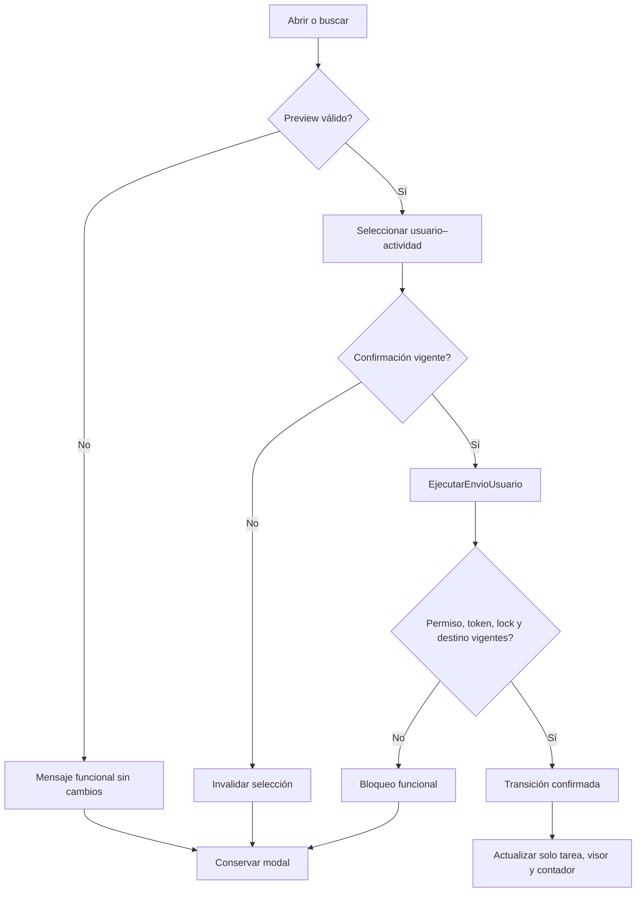

# Validación y ejecución

```mermaid
flowchart TD
    Open[Abrir o buscar] --> Preview{Preview válido?}
    Preview -- No --> Error[Mensaje funcional sin cambios]
    Preview -- Sí --> Select[Seleccionar usuario–actividad]
    Select --> Confirm{Confirmación vigente?}
    Confirm -- No --> Invalidar[Invalidar selección]
    Confirm -- Sí --> Execute[EjecutarEnvioUsuario]
    Execute --> Server{Permiso, token, lock y destino vigentes?}
    Server -- No --> Block[Bloqueo funcional]
    Server -- Sí --> Success[Transición confirmada]
    Success --> Partial[Actualizar solo tarea, visor y contador]
    Error --> Modal[Conservar modal]
    Block --> Modal
    Invalidar --> Modal
```

Una búsqueda nueva, una respuesta tardía o el cierre del modal invalida la selección. Solo un éxito correlacionado alcanza la actualización parcial.
